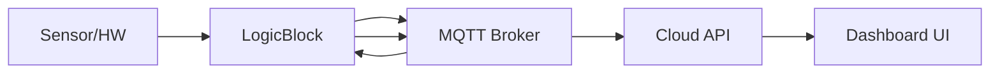

# Vion IoT Documentation Strategy

## 1. Current State Assessment

### What exists today
- VitePress-based docs site with local search
- Getting Started guide (solid, with working code examples)
- Core Concepts section (actor model, LogicBlocks, services, I/O, interfaces, DI)
- How-To Guides (create library, logic block, interface, unit test, run locally/on device, CI)
- Auto-generated Dale SDK API reference (from .NET XML docs via DefaultDocumentation)
- Cloud API reference (auto-generated from OpenAPI/Swagger)
- Best Practices page (skeleton only)
- CI/CD pipeline deploying to Azure Container Registry

### What's missing
- **CLI documentation** — no docs for the CLI tool
- **MQTT interface documentation** — topic structures, payloads, QoS, local broker integration
- **Dashboard / UI web app docs** — component builder, white-label config
- **Cloud API usage guides** — the reference exists but no tutorials/guides for using it
- **Plugin architecture deep-dive** — how to build, package, distribute, version plugins
- **Multi-language SDK strategy** — future language ports beyond .NET
- **Integration guides** — custom service providers, third-party system integration
- **Architecture overview** — system diagram showing edge-to-cloud data flow
- **Deployment & operations** — production deployment, monitoring, troubleshooting
- **MQTT deep integration guide** — using the local edge broker for custom services
- **AI/agent optimization** — llms.txt, structured content for coding assistants

---

## 2. Documentation Framework: Diátaxis

Structure all content using the [Diátaxis framework](https://diataxis.fr/) — the industry standard adopted by Cloudflare, Canonical, Django, and others. It maps perfectly to your product:

| Type | Purpose | Vion Example |
|------|---------|-------------|
| **Tutorials** | Learning-oriented lessons | "Build your first smart thermostat controller" |
| **How-To Guides** | Task-oriented recipes | "How to publish data via MQTT", "How to deploy to production" |
| **Reference** | Information-oriented lookup | SDK API docs, CLI commands, MQTT topic reference, Cloud API |
| **Explanation** | Understanding-oriented discussion | Actor model concepts, edge-cloud architecture, security model |

### Why this matters
Your current docs already loosely follow this — "Concepts" = Explanation, "Guides" = How-To, "API Reference" = Reference. But you're missing **Tutorials** (guided end-to-end learning experiences) and the existing categories bleed into each other.

---

## 3. Proposed Site Structure

```
/
├── Getting Started              ← Quick start (keep as-is, it's good)
│
├── Tutorials/                   ← NEW: End-to-end learning paths
│   ├── Build a temperature monitor (expand existing example)
│   ├── Connect to real hardware
│   ├── Build a dashboard widget
│   ├── Integrate with MQTT client
│   └── Deploy edge-to-cloud
│
├── Concepts/                    ← Explanation (expand existing)
│   ├── Architecture Overview    ← NEW: system diagram, edge/cloud/UI
│   ├── Actor Model & LogicBlocks
│   ├── Services (Properties & Measuring Points)
│   ├── I/O & Hardware Abstraction
│   ├── Logic Interfaces
│   ├── MQTT & Messaging         ← NEW
│   ├── Plugin System             ← NEW
│   ├── Security Model            ← NEW
│   └── Terminology
│
├── Guides/                      ← How-To (expand existing)
│   ├── SDK Development
│   │   ├── Create a library
│   │   ├── Create a logic block
│   │   ├── Create a logic interface
│   │   ├── Create a unit test
│   │   └── Package for distribution
│   ├── CLI                       ← NEW
│   │   ├── Installation
│   │   ├── Command reference
│   │   └── Common workflows
│   ├── MQTT Integration          ← NEW
│   │   ├── Connect to edge broker
│   │   ├── Subscribe to topics
│   │   ├── Publish commands
│   │   └── Build a custom service provider
│   ├── Dashboard                 ← NEW
│   │   ├── Create a dashboard
│   │   ├── Build custom components
│   │   └── White-label configuration
│   ├── Deployment
│   │   ├── Run locally (exists)
│   │   ├── Run on device (exists)
│   │   ├── Production deployment  ← NEW
│   │   └── CI/CD (exists)
│   └── Cloud Integration         ← NEW
│       ├── Cloud API authentication
│       ├── Device management
│       └── Data queries
│
├── Reference/                    ← Pure lookup (restructure existing)
│   ├── Dale SDK API (auto-generated, exists)
│   ├── TestKit API (exists)
│   ├── Cloud API (OpenAPI, exists)
│   ├── CLI Commands               ← NEW
│   ├── MQTT Topics & Payloads     ← NEW
│   ├── Configuration Schema       ← NEW
│   └── Error Codes                ← NEW
│
├── Best Practices               ← Expand skeleton
│   ├── Plugin design patterns
│   ├── Performance
│   ├── Security
│   ├── Testing strategies
│   └── Logging & observability
│
└── Examples                     ← Link to GitHub examples repo + inline snippets
```

---

## 4. What to Document (Priority Order)

### P0 — Must have (blocks adoption)
1. **Architecture overview** with system diagram (edge runtime → MQTT broker → cloud → UI)
2. **MQTT topic reference** — complete topic tree, payload schemas, QoS settings
3. **CLI documentation** — installation, every command, flags, examples
4. **Plugin packaging & distribution** — how to pack, upload, version, update
5. **Production deployment guide** — from dev to device

### P1 — Should have (accelerates adoption)
6. **End-to-end tutorials** — 2-3 realistic scenarios (smart building, energy monitoring, etc.)
7. **Dashboard component builder** docs — how to create/configure dashboard widgets
8. **White-label configuration** guide
9. **MQTT integration guide** — using the local broker for custom service providers
10. **Cloud API usage guides** — not just reference, but "how to query device data"

### P2 — Nice to have (polishes experience)
11. **Best practices** — flesh out the skeleton
12. **Migration guides** — SDK version upgrades
13. **Troubleshooting database** — common errors and solutions
14. **Video walkthroughs** — complement written tutorials
15. **Multi-language SDK docs** — when other language ports arrive

---

## 5. How to Present It

### Follow Stripe's playbook (adapted for IoT)
Stripe is the gold standard for developer docs. Key patterns to adopt:

| Stripe Pattern | Vion Adaptation |
|---------------|----------------|
| Three-column layout (nav / content / code) | VitePress supports this with custom theme work |
| Switchable code samples per language | Start with C# only; add tabs when other SDKs arrive |
| Copy-paste-run examples | Every code sample should compile and run in DevHost |
| Interactive API explorer | Leverage existing OpenAPI/Swagger UI for Cloud API |
| Contextual code highlighting | VitePress code blocks with line highlighting `{3-5}` |

### Design principles
- **Copy-paste-run**: Every code example must work. No pseudo-code in guides.
- **Progressive disclosure**: Start simple, link to deeper content. Don't overwhelm.
- **Show the result**: After every code block, show what happens (screenshot, log output, API response).
- **Task-oriented titles**: "How to deploy a LogicBlock to a device" not "Deployment".
- **Version-aware**: Tag docs with SDK version compatibility.

### Visual aids needed
- **System architecture diagram** — the single most important missing piece
- **Data flow diagrams** — how a sensor reading flows from I/O → LogicBlock → MQTT → Cloud → Dashboard
- **Sequence diagrams** — LogicBlock lifecycle, message passing between actors
- **MQTT topic tree visualization** — hierarchical view of all topics

Use Mermaid diagrams (VitePress supports them natively) for maintainability:


---

## 6. AI & Agent Optimization

### Why this matters now
Developers increasingly use AI coding assistants (Claude, Copilot, Cursor) to integrate with SDKs. Your docs should be optimized for both human and AI consumption.

### llms.txt — implement immediately
Since you're on VitePress, use [`vitepress-plugin-llms`](https://www.npmjs.com/package/vitepress-plugin-llms) to auto-generate:
- **`/llms.txt`** — structured index of all documentation pages
- **`/llms-full.txt`** — complete content dump for deep context

This is a ~5-minute setup with zero downside. Companies like Anthropic, Stripe, and Cloudflare already serve llms.txt.

```bash
pnpm add -D vitepress-plugin-llms
```

```ts
// docs/.vitepress/config.ts
import { llmstxtPlugin } from 'vitepress-plugin-llms'

export default defineConfig({
  vite: {
    plugins: [llmstxtPlugin()]
  }
})
```

### Structured content for AI agents
- **Frontmatter metadata**: Add `description`, `keywords`, `sdk-version` to every page
- **Consistent heading hierarchy**: AI agents parse H2/H3 structure to navigate docs
- **Self-contained code examples**: Include all imports, namespace, class wrapper — agents copy whole blocks
- **Explicit parameter documentation**: Types, defaults, constraints in tables not prose
- **Error code tables**: Machine-parseable error → cause → fix mappings

### MCP (Model Context Protocol) server
Consider publishing a lightweight MCP server for your SDK docs. This would let AI coding assistants query your API reference, MQTT topic structure, and code examples directly. This is an emerging pattern — see how Stripe exposes their docs to agents.

---

## 7. Exemplary Documentation to Study

### IoT / Edge platforms
| Platform | URL | What to learn |
|----------|-----|---------------|
| **Azure IoT Edge** | [learn.microsoft.com/azure/iot-edge](https://learn.microsoft.com/en-us/azure/iot-edge/) | Module development, multi-language SDK docs, deployment manifests |
| **AWS IoT Greengrass** | [docs.aws.amazon.com/greengrass](https://docs.aws.amazon.com/greengrass/) | Component recipes, IPC/MQTT docs, local development |
| **Home Assistant** | [developers.home-assistant.io](https://developers.home-assistant.io/) | Plugin/integration development, community contribution model |
| **Balena** | [docs.balena.io](https://docs.balena.io/) | Edge device lifecycle, fleet management, clear getting started |

### API & SDK documentation gold standards
| Platform | URL | What to learn |
|----------|-----|---------------|
| **Stripe** | [docs.stripe.com](https://docs.stripe.com/) | Three-column layout, interactive examples, multi-language tabs |
| **Twilio** | [twilio.com/docs](https://www.twilio.com/docs) | Multi-SDK approach, quickstarts per language, helper libraries |
| **Cloudflare Workers** | [developers.cloudflare.com/workers](https://developers.cloudflare.com/workers/) | Diátaxis structure, clean navigation, playground integration |

### Plugin architecture docs
| Platform | URL | What to learn |
|----------|-----|---------------|
| **VS Code Extensions** | [code.visualstudio.com/api](https://code.visualstudio.com/api) | Extension points, API reference, samples repo, marketplace |
| **Grafana Plugins** | [grafana.com/developers/plugin-tools](https://grafana.com/developers/plugin-tools/) | Plugin scaffolding, testing, distribution |
| **WordPress Plugins** | [developer.wordpress.org/plugins](https://developer.wordpress.org/plugins/) | Plugin handbook, hooks/filters docs, best practices |

---

## 8. MQTT Documentation Specifically

MQTT is a critical integration surface. Document it like an API:

### What to document
```
Topic Reference
├── Topic naming convention & hierarchy
│   e.g., vion/{deviceId}/services/{serviceId}/properties/{propertyName}
├── Payload schemas (JSON Schema or examples)
├── QoS levels per topic
├── Retained message behavior
├── Wildcard subscription patterns
└── Authentication & ACL

Integration Patterns
├── Subscribe to property changes
├── Send commands to LogicBlocks
├── Build a custom data logger
├── Bridge to external MQTT broker
└── Use with Node-RED / other tools
```

### Presentation format
- **Topic tree table** with columns: Topic Pattern | Direction | QoS | Payload Schema | Description
- **Interactive examples** using `mosquitto_pub`/`mosquitto_sub` CLI commands
- **Payload examples** with annotated JSON
- **Sequence diagrams** for request/response patterns over MQTT

---

## 9. Multi-Language SDK Strategy (Future)

When other language ports arrive, follow Twilio's approach:

- **Language tabs** on every code example (C# | Python | TypeScript | ...)
- **Per-language quickstart** guides
- **Shared concepts** — write once, reference from all language guides
- **Language-specific reference** — auto-generated from each SDK
- **Feature parity matrix** — table showing which features are available in which SDK

VitePress custom components can handle language switching with a persistent preference cookie.

---

## 10. Documentation Framework & Tooling

### Keep VitePress (good choice)
VitePress is excellent for your needs. Enhancements to add:

| Enhancement | Tool/Plugin | Purpose |
|------------|-------------|---------|
| llms.txt generation | `vitepress-plugin-llms` | AI agent optimization |
| Mermaid diagrams | Built-in (VitePress 1.x) | Architecture & flow diagrams |
| API playground | `vitepress-openapi` (already installed) | Interactive Cloud API testing |
| Code group tabs | Built-in VitePress feature | Multi-language code samples |
| Search | Algolia DocSearch (upgrade from local) | Better search at scale |
| Versioning | `vitepress-versioning` or custom | SDK version-specific docs |
| Changelog | Auto-generated from git tags | Track what changed per release |

### Content workflow
1. **Docs-as-code**: Keep docs in git (already doing this)
2. **PR reviews for docs**: Same review process as code
3. **Auto-generated API reference**: Keep DefaultDocumentation + OpenAPI (already doing this)
4. **Link checking**: Add `markdown-link-check` to CI
5. **Screenshot automation**: Consider Playwright for UI screenshots that stay current

---

## 11. Immediate Action Plan

### Week 1-2: Foundation
- [ ] Add `vitepress-plugin-llms` for AI optimization
- [ ] Create system architecture diagram (Mermaid)
- [ ] Write Architecture Overview concept page
- [ ] Add frontmatter metadata to all existing pages

### Week 3-4: Critical gaps
- [ ] Document CLI commands (reference format)
- [ ] Document MQTT topic reference (table format)
- [ ] Write production deployment guide
- [ ] Write plugin packaging & distribution guide

### Week 5-8: Tutorials & polish
- [ ] Create 2 end-to-end tutorials (realistic scenarios)
- [ ] Flesh out Best Practices page
- [ ] Add Mermaid diagrams to concept pages
- [ ] Write MQTT integration guide with examples

### Week 9-12: Dashboard & advanced
- [ ] Document dashboard component builder
- [ ] Write white-label configuration guide
- [ ] Add Cloud API usage guides (beyond reference)
- [ ] Create custom service provider guide

---

## 12. Measuring Success

- **Time to first LogicBlock**: How fast can a new developer go from zero to running code?
- **Support ticket reduction**: Track which questions stop appearing
- **Search analytics**: What do people search for and not find?
- **AI agent success rate**: Can Claude/Copilot correctly generate integration code from your docs?
- **Page engagement**: Time on page, scroll depth (add analytics)
- **Community contributions**: PRs to docs repo
