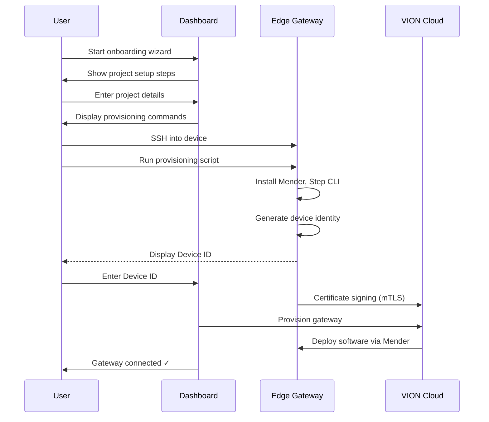

# Onboarding an Edge Gateway

Onboarding connects a physical device to the VION platform. The process is guided through the [Dashboard onboarding wizard](https://vion.test.ecocoa.ch/#/onboarding) and involves running a provisioning script on the device via SSH.

## Overview



## Step 1: Start the Wizard

In the Dashboard, start the onboarding process. You'll be asked to:

1. **Select a use case** — Energy Management, Building Automation, or Empty Project
2. **Create a project** — provide a company name and project name
3. **Choose gateway type** — Simulation (no hardware needed) or Own Hardware

If you select **Own Hardware**, the wizard continues with device setup.

## Step 2: Prepare the Device

Before running the provisioning script, make sure your device:

- Has a fresh, up-to-date OS installed (e.g., Raspberry Pi OS)
- Is connected to the internet
- Has SSH access enabled

Connect to your device via SSH:

```bash
ssh user@<device-ip>
```

## Step 3: Run the Provisioning Script

The Dashboard displays two commands. Copy and run them on the device:

**Download the script:**
```bash
curl -X 'GET' '<url-shown-in-dashboard>' \
  -H 'accept: */*' > installEdgeGateway.sh
```

::: info
The script URL is unique to your platform environment. Always use the exact URL shown in the Dashboard — do not copy it from this documentation.
:::

**Run the script:**
```bash
chmod +x installEdgeGateway.sh && sudo ./installEdgeGateway.sh
```

The script is interactive and will prompt you through each step. It installs and configures:

| Component | Purpose |
|-----------|---------|
| **Mender client** | Over-the-air (OTA) software updates |
| **Step CLI** | Device certificate management (mTLS) |
| **Docker & Docker Compose** | Container runtime for VION services |
| **Mender update modules** | Script and Docker Compose update support |

## Step 4: Enter the Device ID

At the end of the script, a **Device ID** is displayed on the terminal:

```
NEW device id! Please enter it in the ui!

aB3xK-Ym9pQ-Rz7wL-nhpClient
```

Copy this ID and enter it in the Dashboard wizard.

::: warning
The Device ID is generated once per device. If the script detects an existing ID (from a previous run), it will stop to prevent duplicate registrations.
:::

## Step 5: Certificate Provisioning

After you enter the Device ID, the script automatically:

1. Downloads the platform root CA certificate
2. Generates an EC P-384 key pair on the device
3. Creates a Certificate Signing Request (CSR)
4. Sends the CSR to the VION CA for signing
5. Receives and stores the signed device certificate

This establishes **mutual TLS (mTLS)** between the device and the VION Cloud — the device proves its identity on every connection.

## Step 6: Software Deployment

Once the device is registered, the Dashboard triggers the initial software deployment. The wizard shows the progress as each component is deployed:

- **Infrastructure modules** — base system configuration
- **Infrastructure Docker** — container runtime setup
- **Software bundle** — VION runtime components (Dale, Mesh, monitoring agents)

Deployment is handled by Mender and typically takes 2–5 minutes. The Dashboard polls every 15 seconds and updates the status in real time.

::: tip
If deployment fails, click **Retry** in the wizard. Common issues are covered in [Troubleshooting](/edge-gateway/troubleshooting).
:::

## What Happens After Onboarding

Once the gateway shows as connected:

- The **Dale runtime** is running and ready to execute logic blocks
- The **Mesh gateway** is connected to the VION Cloud via MQTT over TLS
- **Telemetry** is flowing to the observability stack
- You can deploy logic block libraries and configure logic in the Dashboard
