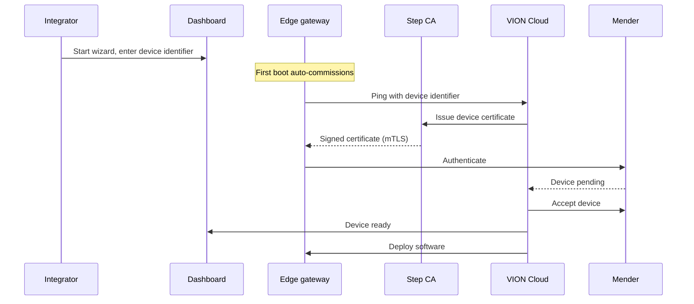

# Onboarding an Edge Gateway

Onboarding connects a board to the VION platform. You flash a prebuilt image, power on the device, and register the device identifier it shows you in the [Dashboard onboarding wizard](https://dashboard.vion.swiss/#/onboarding). On first boot the device commissions itself — no provisioning script is involved.

## Overview

The diagram below shows the participants and the order of the commissioning stages.



## Step 1: Start the wizard

In the Dashboard, start the onboarding process. The wizard asks you to:

1. Select a use case — Energy Management, Building Automation, or an empty project
2. Create a project — provide a company name and project name
3. Choose a gateway type — Simulation (no hardware needed) or Own hardware

If you choose **Simulation**, VION Cloud creates a simulated gateway and you can skip the flashing steps. If you choose **Own hardware**, continue below.

## Step 2: Download the board image

Identify your board on the [supported devices](/edge-gateway/supported-devices) page and download its image. The image is a gzip-compressed file served from `https://images.vion.swiss/releases/<board>.img.gz`, where `<board>` is the token for your board.

## Step 3: Flash the image

Write the image to the SD card or eMMC with [balenaEtcher](https://etcher.balena.io/) (recommended) or another raw image writer: select the `.img.gz` you downloaded, select the target card, and write. The tool decompresses the image as it writes. Per-device settings such as WiFi and hostname are configured through an interactive commissioning prompt on the device's first login.

### Boards with on-module eMMC

The IPCBox-CM5-A has no card to remove: its Compute Module 5 carries the eMMC soldered on, so you put the module into USB device mode and write it over the cable. Install [rpiboot](https://github.com/raspberrypi/usbboot) on your computer first, and disconnect every other USB storage device so there is only one disk you could write to by mistake.

1. Power the enclosure off, hold its **BOOT** button, apply power, connect a data-capable USB-C cable to your computer, and release **BOOT** once the power indicator lights.
2. Run `sudo rpiboot`. It exposes the eMMC to your computer as an ordinary USB disk.
3. Confirm that disk is the module before you write: it appeared only just now, its transport is USB, and its size matches the module's eMMC. A size mismatch means you are looking at something else.
4. Write the `.img.gz` to it with balenaEtcher, which verifies the write as it finishes.
5. Power the enclosure down and **disconnect the USB-C cable**. Left connected, the module stays in device mode and will not boot.

A microSD card in the enclosure's slot is ignored on a module with eMMC — leave the slot empty.

## Step 4: Boot the device

Insert the SD card or eMMC into the board and apply power; a module with on-module eMMC needs only power, with the USB-C cable disconnected. The first boot runs auto-commissioning: it starts Docker, registers the Mender client, and enrolls a device certificate with Step CA. These tools are baked into the image, so nothing is installed over the network at this stage.

The IPCBox-CM5-A takes about two and a half minutes to reach this point and lights no activity LED while it works.

On the IPCBox-CM5-A nothing pre-writes the per-device settings onto the boot partition, so the device falls through to the interactive commissioning wizard. Log in over SSH to reach it:

```bash
ssh root@<device-ip>    # password: vion
```

You are forced to change the password, and the wizard starts straight after it.

When commissioning reaches the point where it needs to be registered, the device shows a **device identifier** derived from the board's hardware. This identifier is stable across reflashes — flashing a fresh image onto the same board produces the same identifier.

## Step 5: Register the device identifier

Enter the device identifier from the previous step into the wizard's **Set up VION** step. Registering the identifier approves the device, after which VION Cloud issues its certificate and accepts it into Mender.

## Commissioning status

After you enter the identifier, the wizard shows live commissioning status. The stages are:

| Status | Meaning |
|--------|---------|
| Key approved — waiting for the device | You registered the identifier; VION Cloud is waiting for the device to check in. |
| Certificate issued | The device requested and received its mTLS certificate from Step CA. |
| Device accepted | VION Cloud accepted the device into Mender. |
| Device ready | Commissioning finished; the device is ready for software deployment. |
| Timed out — check the device | The device did not check in within the commissioning window. Confirm it is powered and online. |
| Commissioning failed | Commissioning could not complete. See [Troubleshooting](/edge-gateway/troubleshooting). |

Once the device is ready, its initial software (Dale runtime, Mesh) is deployed and the wizard reports the gateway as connected. Depending on the onboarding flow, this deployment runs automatically or you trigger it from the Dashboard.

## What happens after onboarding

Once the gateway shows as connected:

- The Dale runtime is running and ready to execute logic blocks
- Mesh is connected to VION Cloud and bridges telemetry and commands
- Telemetry is flowing to the observability stack
- You can deploy logic block libraries and configure logic in the Dashboard

For day-to-day management, see [Dashboard Setup](/edge-gateway/dashboard-setup).
