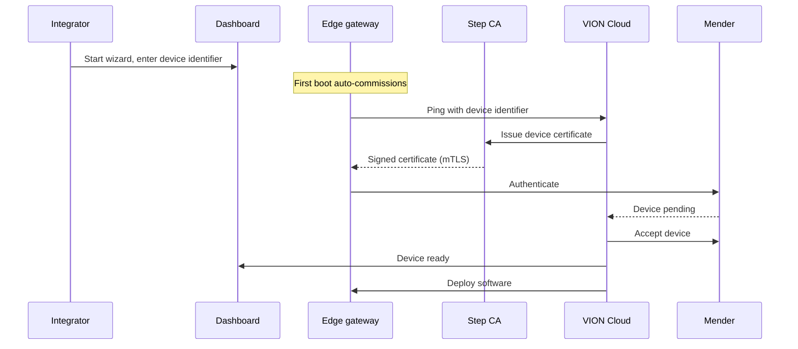

# Onboarding an Edge Gateway

Onboarding connects a board to the VION platform. You flash a prebuilt image, power on the device, and register the device identifier it shows you in the [Dashboard onboarding wizard](https://dashboard.vion.swiss/#/onboarding). On first boot the device commissions itself — no SSH access or provisioning script is involved.

## Overview

The diagram below shows the participants and the order of the commissioning stages.

## Step 1: Start the wizard

In the Dashboard, start the onboarding process. The wizard asks you to:

1. Select a use case — Energy Management, Building Automation, or an empty project
2. Create a project — provide a company name and project name
3. Choose a gateway type — Simulation (no hardware needed) or Own hardware

If you choose **Simulation**, VION Cloud creates a simulated gateway and you can skip the flashing steps. If you choose **Own hardware**, continue below.

## Step 2: Download the board image

Identify your board on the [supported devices](/edge-gateway/supported-devices) page and download its image. The image is a gzip-compressed file served from `https://images.vion.swiss/releases/<board>.img.gz`, where `<board>` is the token for your board.

## Step 3: Flash the image

Write the image to the SD card or eMMC. Use the VION Imager, which also applies per-device settings, or any raw image-flashing tool such as balenaEtcher.

### Flash with the VION Imager

The VION Imager writes the image and stores hostname, timezone, locale, cloud environment, and (on Raspberry Pi) WiFi settings on the boot partition, where they survive future updates. Follow these steps:

1. Pick the `.img.gz` image you downloaded.
2. Pick the target SD card. The list is filtered to removable, USB, and MMC devices.
3. Fill in the per-device settings: VION environment, hostname, timezone, and locale. On Raspberry Pi boards, also fill in the WiFi SSID, passphrase, and country. NanoPi and Beckhoff CX boards are Ethernet-only and show no WiFi fields.
4. Confirm the destructive write. The Imager requires a two-step acknowledgement because writing erases the card.
5. The Imager writes the image, applies the settings, and ejects the card.

The WiFi passphrase can be stored as a precomputed PMK hash instead of plaintext so the human passphrase never lands on the card.

### Flash with balenaEtcher

If you flash with balenaEtcher or another raw writer, decompress is handled automatically by the tool. Select the `.img.gz`, select the target card, and write. The device falls back to an interactive commissioning prompt on first login, so per-device settings are not preset — prefer the VION Imager when you need WiFi or a custom hostname.

## Step 4: Boot the device

Insert the SD card or eMMC into the board and apply power. The first boot runs auto-commissioning: it starts Docker, registers the Mender client, and enrolls a device certificate with Step CA. These tools are baked into the image, so nothing is installed over the network at this stage.

When commissioning reaches the point where it needs to be registered, the device shows a **device identifier** derived from the board's hardware. This identifier is stable across reflashes — flashing a fresh image onto the same board produces the same identifier.

## Step 5: Register the device identifier

Enter the device identifier from the previous step into the wizard's **Set up VION** step. Registering the identifier approves the device, after which VION Cloud issues its certificate and accepts it into Mender.

## Commissioning status

After you enter the identifier, the wizard shows live commissioning status. The stages are:

| Status | Meaning |
|--------|---------|
| Key approved — waiting for the device | You registered the identifier; VION Cloud is waiting for the device to check in. |
| Certificate issued | The device requested and received its mTLS certificate from Step CA. |
| Device accepted | VION Cloud accepted the device into Mender. |
| Device ready | Commissioning finished; the device is ready for software deployment. |
| Timed out — check the device | The device did not check in within the commissioning window. Confirm it is powered and online. |
| Commissioning failed | Commissioning could not complete. See [Troubleshooting](/edge-gateway/troubleshooting). |

Once the device is ready, VION Cloud deploys the initial software (Dale runtime, Mesh, monitoring agents) and the wizard reports the gateway as connected.

## What happens after onboarding

Once the gateway shows as connected:

- The Dale runtime is running and ready to execute logic blocks
- Mesh is connected to VION Cloud and bridges telemetry and commands
- Telemetry is flowing to the observability stack
- You can deploy logic block libraries and configure logic in the Dashboard

For day-to-day management, see [Dashboard Setup](/edge-gateway/dashboard-setup).
