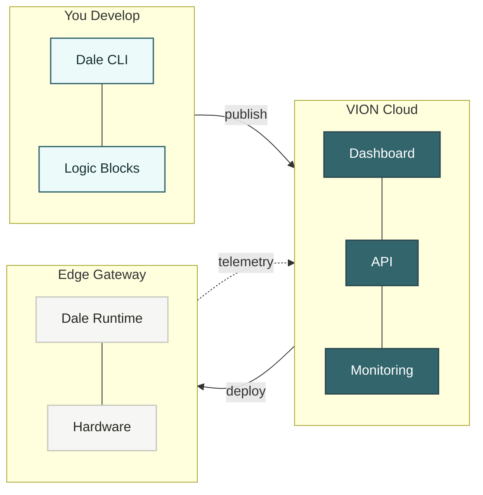
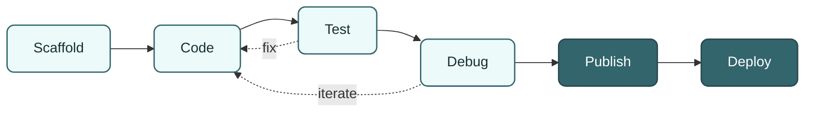
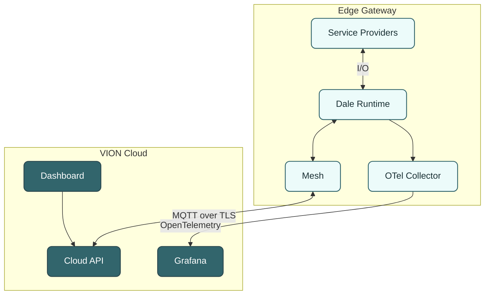
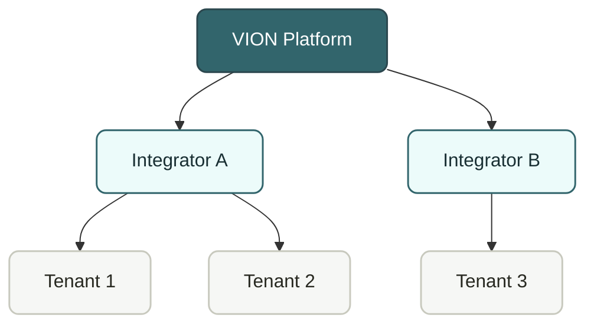

# What is VION?

VION is an **Edge Operations Platform** for building, deploying, and operating IoT logic on edge gateways. It is built for system integrators who need to connect hardware, run control logic, and give their customers visibility — without building infrastructure from scratch.

VION is the product as a whole. The **Dale SDK** is the part integrators build on — a .NET SDK and CLI for writing logic blocks that run on the edge. On the edge gateway, the **Dale runtime** hosts those logic blocks as plugins, and **Mesh** bridges the gateway to VION Cloud. The Dale SDK is source-available at [VION-IoT/dale-sdk](https://github.com/VION-IoT/dale-sdk/); packages are published to [nuget.org](https://www.nuget.org/) under the `Vion.*` prefix.

## The Big Picture

You write logic in C#. VION Cloud manages deployment and monitoring. The edge runs the logic close to the hardware.

## Development Workflow

Everything happens through the **Dale CLI** — from project creation to cloud deployment. Local testing with DevHost and TestKit means you don't need hardware to develop.

## What Runs Where

**Logic runs on the edge** — close to the hardware, with millisecond latency and offline resilience. VION Cloud handles configuration, deployment, and monitoring but is not in the critical path.

## Who Is It For

VION is built for **system integrators** — companies that develop IoT solutions for their customers. Each integrator manages their own logic block libraries, tenants, and edge gateways independently. Role-based access control is enforced at every level.

## Next Steps

- **[Key Concepts](/introduction/key-concepts)** — design principles and mental model
- **[Quick Start](/introduction/quick-start)** — build and run your first logic block
- **[SDK Development](/sdk/installation)** — dive into the Dale SDK

