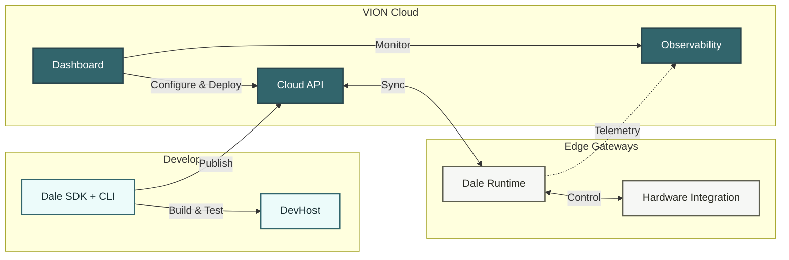

# What is VION?

VION is an **Edge Operations Platform** that enables system integrators to build, deploy, and operate IoT logic on edge gateways — with cloud connectivity for configuration, monitoring, and management.

## Architecture

## Components

### Dale SDK & Runtime

The core development framework. Dale provides a .NET SDK built on the [Proto.Actor](https://proto.actor/) model where **logic blocks** are actors that process I/O, maintain state, and communicate with each other. The Dale runtime executes these logic blocks on the edge gateway.

Key features:
- Actor-based concurrency (each logic block is an independent actor)
- Declarative attributes for properties, services, timers, and commands
- Built-in persistence with automatic state recovery
- DevHost for local development with a web UI

### Dale CLI

A command-line tool for the full development lifecycle:
- `dale new` — scaffold a new logic block library
- `dale build` / `dale test` — build and test locally
- `dale dev` — start the local DevHost with web UI
- `dale add` — generate logic blocks, properties, timers
- `dale upload` — publish to VION Cloud
- `--output json` — structured output for CI/CD and AI agents

### Mesh Gateway

The edge-to-cloud bridge running on each device. Mesh handles:
- Bidirectional MQTT communication (local and cloud)
- Property state synchronization
- Condition-based and schedule-based automations
- Service provider registration and provisioning
- System health monitoring

### Cloud API

Multi-tenant REST API managing the platform:
- Device and node management
- Logic configuration deployment
- Service provider lifecycle
- RBAC with Keycloak-based OIDC authentication
- Interactive API reference via [Scalar](https://cloudapi.test.ecocoa.ch/scalar/v1)

### Dashboard

Vue 3 web application for operators and integrators:
- Project and node management
- Visual logic configuration editor
- Device onboarding wizard
- Monitoring and alerts

### Observability Stack

Each edge gateway exports telemetry via OpenTelemetry:
- **Grafana** — dashboards and visualization
- **Prometheus / Mimir** — metrics storage and querying
- **Alloy** — telemetry collection agent on the device

## Multi-Tenancy Model

VION uses a three-level hierarchy:

| Level | Description |
|-------|-------------|
| **Platform** | The VION platform instance |
| **Integrator** | A system integrator company using VION |
| **Tenant** | An end-customer of the integrator |

Each integrator manages their own tenants, devices, and logic libraries independently.

## Next Steps

- [Quick Start](/introduction/quick-start) — build and run your first logic block
- [Key Concepts](/introduction/key-concepts) — understand the terminology and mental model
- [SDK Development](/sdk/installation) — dive into the SDK
