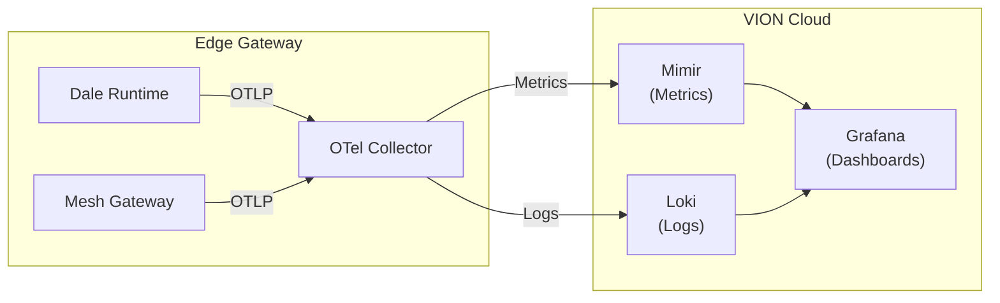

# Observability Overview

VION provides a built-in observability stack that collects metrics, logs, and traces from your edge gateways and makes them available through Grafana dashboards.

## Architecture

## Data Flow

1. **Edge components** (Dale runtime, Mesh gateway) emit telemetry via the OpenTelemetry Protocol (OTLP)
2. The **Dale runtime** also emits per-actor vitals (`vion.actor.*`) alongside its logs and metrics, feeding the Actor Vitals dashboard
3. **OTel Collector** running on the gateway receives, batches, and forwards telemetry to VION Cloud
4. **Mimir** stores metrics (Prometheus-compatible) and **Loki** stores logs
5. **Grafana** provides dashboards to query and visualize the data

## What Data Is Available

| Data Type | Source | Storage | Query Language |
|-----------|--------|---------|----------------|
| **Metrics** | Edge-gateway resource usage (memory, CPU, GC, messaging) | Mimir | PromQL |
| **Actor Vitals** | Per-actor health from the Dale runtime (`vion.actor.*`) | Mimir | PromQL |
| **Logs** | Structured logs from all edge components | Loki | LogQL |

## Tenant Isolation

All telemetry data is tagged with a `tenant_id` label. Each tenant can only see their own data — isolation is enforced at the Grafana level through teams and folders.
