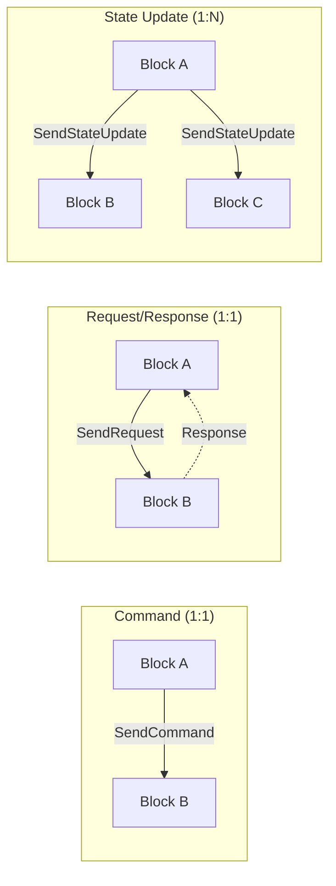

# Logic Interfaces

logic interfaces are the communication channels between logic blocks. They are defined as C# interfaces, and connections between them are configured at design time in the Dashboard. Each interface declares what messages it can send or receive, enabling blocks to collaborate without direct references to one another.

## What are Logic Interfaces?

A logic interface is a C# interface that a logic block implements to declare a communication endpoint. When two blocks implement complementary interfaces, the Dashboard allows you to wire them together so messages can flow between them.

Key characteristics:

- **Defined as C# interfaces** attached to logic blocks
- **Connected at configuration time** in the Dashboard (not in code)
- **Identified at runtime** by an `InterfaceId` that the framework provides
- **Three message patterns**: Commands, Request/Response, and State Updates



## Contracts

A **Contract** groups related messages that travel between two interfaces. Contracts declare the direction of communication and contain one or more message definitions.

Use the `[Contract]` attribute on a static class to define a contract. The `BetweenInterface` and `AndInterface` properties name the two interfaces, and the `Direction` enum specifies which way messages flow.

```csharp
[Contract(BetweenInterface = "IToggler", AndInterface = "IToggleable",
          Direction = ContractDirection.BetweenToAnd)]
public static class Toggling
{
    [StateUpdate(From = "IToggler", To = "IToggleable")]
    public readonly record struct TogglePressed;

    [StateUpdate(From = "IToggler", To = "IToggleable")]
    public readonly record struct ToggleReleased;
}
```

| Property | Description |
|---|---|
| `BetweenInterface` | The first interface in the contract |
| `AndInterface` | The second interface in the contract |
| `Direction` | A `ContractDirection` value: `BetweenToAnd`, `AndToBetween`, or `Bidirectional` |

Messages inside the contract are annotated with one of three attributes: `[Command]`, `[RequestResponse]`, or `[StateUpdate]`.

## Commands (Fire-and-Forget)

A **Command** is a one-way message sent from one block to a specific connected block. The sender does not expect a reply.

### Declaring a Command

Inside a contract, decorate a message with the `[Command]` attribute:

```csharp
[Contract(BetweenInterface = "IPingService", AndInterface = "IPingReceiver",
          Direction = ContractDirection.BetweenToAnd)]
public static class PingContract
{
    [Command(From = "IPingService", To = "IPingReceiver")]
    public readonly record struct Ping(string Payload);
}
```

### Sending a Command

The sender calls `this.SendCommand` with the target interface ID and the message:

```csharp
this.SendCommand(targetInterfaceId, new PingContract.Ping("hello"));
```

### Receiving a Command

The receiver implements `HandleCommand<TMessage>`:

```csharp
public void HandleCommand(PingContract.Ping message)
{
    Logger.LogInformation("Received ping: {Payload}", message.Payload);
}
```

## Request/Response

A **Request/Response** exchange is a synchronous-style query. The sender issues a request to a specific connected block and later receives a typed response.

### Declaring a Request/Response

Use the `[RequestResponse]` attribute, specifying the response type:

```csharp
[Contract(BetweenInterface = "IPinger", AndInterface = "IPonger",
          Direction = ContractDirection.BetweenToAnd)]
public static class PingPongContract
{
    [RequestResponse(From = "IPinger", To = "IPonger",
                     ResponseType = typeof(Pong))]
    public readonly record struct Ping(string Payload);

    public readonly record struct Pong(string Reply);
}
```

### Sending a Request

The sender calls `this.SendRequest` and implements `HandleResponse` to receive the reply:

```csharp
// Send the request
this.SendRequest(pongerInterfaceId, new PingPongContract.Ping("ping!"));

// Handle the response when it arrives
public void HandleResponse(InterfaceId sender, PingPongContract.Pong response)
{
    Logger.LogInformation("Got pong: {Reply}", response.Reply);
}
```

### Handling a Request

The responder implements `HandleRequest<TRequest>` and returns the response directly:

```csharp
public PingPongContract.Pong HandleRequest(PingPongContract.Ping request)
{
    return new PingPongContract.Pong($"pong for {request.Payload}");
}
```

## State Updates (Broadcast)

A **State Update** is a one-to-many notification. The sender broadcasts a message to all blocks connected through that interface.

### Declaring a State Update

Use the `[StateUpdate]` attribute:

```csharp
[Contract(BetweenInterface = "IToggler", AndInterface = "IToggleable",
          Direction = ContractDirection.BetweenToAnd)]
public static class Toggling
{
    [StateUpdate(From = "IToggler", To = "IToggleable")]
    public readonly record struct TogglePressed;

    [StateUpdate(From = "IToggler", To = "IToggleable")]
    public readonly record struct ToggleReleased;
}
```

### Sending a State Update

The sender calls `this.SendStateUpdate`. This broadcasts the message to **all** blocks connected through the interface:

```csharp
this.SendStateUpdate(new Toggling.TogglePressed());
```

### Receiving a State Update

The receiver implements `HandleStateUpdate` and receives the sender's `InterfaceId`:

```csharp
public void HandleStateUpdate(InterfaceId sender, Toggling.TogglePressed message)
{
    Logger.LogInformation("Toggle pressed by {Sender}", sender);
    IsOn = true;
}

public void HandleStateUpdate(InterfaceId sender, Toggling.ToggleReleased message)
{
    Logger.LogInformation("Toggle released by {Sender}", sender);
    IsOn = false;
}
```

## Implementing Both Sides

Below is a complete example showing two logic blocks communicating through a toggle interface. The `ToggleSwitch` block sends state updates, and the `ToggleLight` block receives them.

### The Contract

```csharp
[Contract(BetweenInterface = "IToggler", AndInterface = "IToggleable",
          Direction = ContractDirection.BetweenToAnd)]
public static class Toggling
{
    [StateUpdate(From = "IToggler", To = "IToggleable")]
    public readonly record struct TogglePressed;

    [StateUpdate(From = "IToggler", To = "IToggleable")]
    public readonly record struct ToggleReleased;
}
```

### The Sender: ToggleSwitch

```csharp
[LogicBlockInfo("Toggle Switch", "toggle-line")]
public class ToggleSwitch : LogicBlockBase, IToggler
{
    public ToggleSwitch(ILogger logger) : base(logger) { }

    [ServiceProperty("Pressed")]
    public bool Pressed { get; private set; }

    protected override void Ready()
    {
        // React to an external input (e.g., a digital I/O service)
    }

    private void OnPressed()
    {
        Pressed = true;
        this.SendStateUpdate(new Toggling.TogglePressed());
    }

    private void OnReleased()
    {
        Pressed = false;
        this.SendStateUpdate(new Toggling.ToggleReleased());
    }
}
```

### The Receiver: ToggleLight

```csharp
[LogicBlockInfo("Toggle Light", "lightbulb-line")]
public class ToggleLight : LogicBlockBase, IToggleable
{
    public ToggleLight(ILogger logger) : base(logger) { }

    [ServiceProperty("Light On")]
    public bool IsOn { get; private set; }

    protected override void Ready() { }

    public void HandleStateUpdate(InterfaceId sender, Toggling.TogglePressed message)
    {
        IsOn = true;
    }

    public void HandleStateUpdate(InterfaceId sender, Toggling.ToggleReleased message)
    {
        IsOn = false;
    }
}
```

When these two blocks are connected in the Dashboard (the `IToggler` output of ToggleSwitch wired to the `IToggleable` input of ToggleLight), pressing the switch causes the light to turn on, and releasing it turns the light off. Because State Updates are broadcast, you can connect a single ToggleSwitch to multiple ToggleLight blocks and they will all respond.
