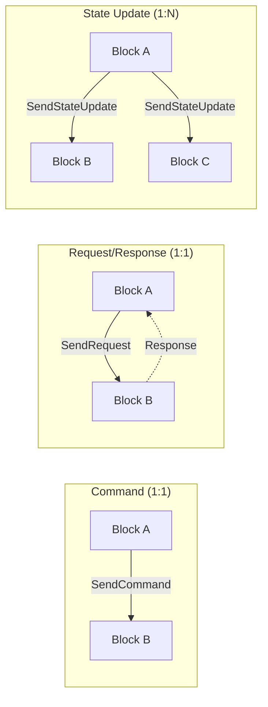

# Logic Interfaces

logic interfaces are the communication channels between logic blocks. They are defined as C# interfaces, and connections between them are configured at design time in the dashboard. Each interface declares what messages it can send or receive, enabling blocks to collaborate without direct references to one another.

## What are Logic Interfaces?

A logic interface is a C# interface that a logic block implements (or composes) to declare a communication endpoint. When two blocks implement complementary interfaces, the dashboard allows you to wire them together so messages can flow between them.

Key characteristics:

- **Defined as C# interfaces** attached to logic blocks
- **Connected at configuration time** in the dashboard (not in code)
- **Identified at runtime** by an `InterfaceId` that the framework provides
- **Three message patterns**: Commands, Request/Response, and State Updates



## Three Concepts, One Family

The interface family separates three distinct concerns:

| Attribute | Applies To | Purpose |
|-----------|------------|---------|
| `[LogicBlockContract]` | A static class | Defines the message catalog that flows between two interfaces. |
| `[LogicBlockInterfaceBinding]` | A class or property | Metadata for an implementation — identifier, display name, tags. |
| `[RequiresLogicBlockInterface]` | A class | Declares that the block needs another block's implementation linked at runtime. |

The first defines the message vocabulary. The second annotates an existing implementation. The third declares a runtime dependency that must be wired in.

## Contracts

A **contract** groups related messages that travel between two interfaces. Contracts declare the direction of communication and contain one or more message definitions.

Use `[LogicBlockContract]` on a static class to define a contract. `BetweenInterface` and `AndInterface` name the two interfaces, and `Direction` specifies which way messages flow.

```csharp
[LogicBlockContract(BetweenInterface = "IToggler",
                    AndInterface = "IToggleable",
                    Direction = ContractDirection.BetweenToAnd)]
public static class Toggling
{
    [StateUpdate(From = "IToggler", To = "IToggleable")]
    public readonly record struct TogglePressed;

    [StateUpdate(From = "IToggler", To = "IToggleable")]
    public readonly record struct ToggleReleased;
}
```

| Field | Description |
|-------|-------------|
| `BetweenInterface` (required) | The first interface in the contract. |
| `AndInterface` (required) | The second interface in the contract. |
| `Direction` | A `ContractDirection` value: `BetweenToAnd`, `AndToBetween`, or `Bidirectional`. |
| `BetweenDefaultName` | Optional display name for the `Between` side in the dashboard. |
| `AndDefaultName` | Optional display name for the `And` side in the dashboard. |

Messages inside the contract are annotated with one of three attributes: `[Command]`, `[RequestResponse]`, or `[StateUpdate]`.

## Commands (Fire-and-Forget)

A **command** is a one-way message sent from one block to a specific connected block. The sender does not expect a reply.

### Declaring a Command

Inside a contract, decorate a message with `[Command]`:

```csharp
[LogicBlockContract(BetweenInterface = "IPingService",
                    AndInterface = "IPingReceiver",
                    Direction = ContractDirection.BetweenToAnd)]
public static class PingContract
{
    [Command(From = "IPingService", To = "IPingReceiver")]
    public readonly record struct Ping(string Payload);
}
```

### Sending a Command

The sender calls `this.SendCommand` with the target interface ID and the message:

```csharp
this.SendCommand(targetInterfaceId, new PingContract.Ping("hello"));
```

### Receiving a Command

The receiver implements `HandleCommand<TMessage>`:

```csharp
public void HandleCommand(PingContract.Ping message)
{
    Logger.LogInformation("Received ping: {Payload}", message.Payload);
}
```

## Request/Response

A **request/response** exchange is a synchronous-style query. The sender issues a request to a specific connected block and later receives a typed response.

### Declaring a Request/Response

Use `[RequestResponse]`, specifying the response type:

```csharp
[LogicBlockContract(BetweenInterface = "IPinger",
                    AndInterface = "IPonger",
                    Direction = ContractDirection.BetweenToAnd)]
public static class PingPongContract
{
    [RequestResponse(From = "IPinger", To = "IPonger",
                     ResponseType = typeof(Pong))]
    public readonly record struct Ping(string Payload);

    public readonly record struct Pong(string Reply);
}
```

### Sending a Request

The sender calls `this.SendRequest` and implements `HandleResponse` to receive the reply:

```csharp
// Send the request.
this.SendRequest(pongerInterfaceId, new PingPongContract.Ping("ping!"));

// Handle the response when it arrives.
public void HandleResponse(InterfaceId sender, PingPongContract.Pong response)
{
    Logger.LogInformation("Got pong: {Reply}", response.Reply);
}
```

### Handling a Request

The responder implements `HandleRequest<TRequest>` and returns the response directly:

```csharp
public PingPongContract.Pong HandleRequest(PingPongContract.Ping request)
{
    return new PingPongContract.Pong($"pong for {request.Payload}");
}
```

## State Updates (Broadcast)

A **state update** is a one-to-many notification. The sender broadcasts a message to all blocks connected through that interface.

### Declaring a State Update

Use `[StateUpdate]`:

```csharp
[LogicBlockContract(BetweenInterface = "IToggler",
                    AndInterface = "IToggleable",
                    Direction = ContractDirection.BetweenToAnd)]
public static class Toggling
{
    [StateUpdate(From = "IToggler", To = "IToggleable")]
    public readonly record struct TogglePressed;

    [StateUpdate(From = "IToggler", To = "IToggleable")]
    public readonly record struct ToggleReleased;
}
```

### Sending a State Update

The sender calls `this.SendStateUpdate`. This broadcasts the message to **all** blocks connected through the interface:

```csharp
this.SendStateUpdate(new Toggling.TogglePressed());
```

### Receiving a State Update

The receiver implements `HandleStateUpdate` and receives the sender's `InterfaceId`:

```csharp
public void HandleStateUpdate(InterfaceId sender, Toggling.TogglePressed message)
{
    Logger.LogInformation("Toggle pressed by {Sender}", sender);
    IsOn = true;
}

public void HandleStateUpdate(InterfaceId sender, Toggling.ToggleReleased message)
{
    Logger.LogInformation("Toggle released by {Sender}", sender);
    IsOn = false;
}
```

## Interface Bindings

In the simplest case, a logic block implements an interface via plain C# inheritance and the framework discovers the binding automatically:

```csharp
[LogicBlock(Name = "Toggle Switch", Icon = "toggle-line")]
public class ToggleSwitch : LogicBlockBase, IToggler
{
    // The framework registers an IToggler binding from the class declaration alone.
}
```

`[LogicBlockInterfaceBinding]` is **optional metadata** for an existing implementation. Use it when you need to override identification or labelling, or when the implementation lives on a property whose type implements the interface (a composed sub-component — e.g., a charging station with multiple charging-point children):

```csharp
// Optional: override the binding's identifier or display name on the class.
[LogicBlock(Name = "Toggle Switch", Icon = "toggle-line")]
[LogicBlockInterfaceBinding(typeof(IToggler), DefaultName = "Switch")]
public class ToggleSwitch : LogicBlockBase, IToggler
{
    // ...
}

// Property-target: an inner property holds the implementation.
[LogicBlock(Name = "Charging Station")]
public class ChargingStation : LogicBlockBase
{
    [LogicBlockInterfaceBinding(typeof(IChargingPoint), DefaultName = "Point 1")]
    public ChargingPoint Point1 { get; }

    [LogicBlockInterfaceBinding(typeof(IChargingPoint), DefaultName = "Point 2")]
    public ChargingPoint Point2 { get; }
}
```

| Field | Description |
|-------|-------------|
| `ForInterface` (constructor) | The interface this binding applies to. Required, passed via `typeof(IFoo)`. |
| `Identifier` | Stable identifier used by the dashboard to match wiring across upgrades. |
| `DefaultName` | Display name in the dashboard. Defaults to the C# member name. |
| `Tags` | Optional string tags for grouping or filtering. |

`AllowMultiple = true` — a class or property type that implements several interfaces gets one `[LogicBlockInterfaceBinding]` per interface.

## Interface Dependencies

`[RequiresLogicBlockInterface]` declares that a block requires an implementation of an interface to be linked at runtime. The block does not implement the interface itself; instead, the dashboard prompts the operator to wire a peer block's implementation in.

```csharp
[LogicBlock(Name = "Telemetry Recorder")]
[RequiresLogicBlockInterface(typeof(IProducer),
                             DefaultName = "Source",
                             Cardinality = CardinalityType.Optional,
                             Sharing = SharingType.Exclusive,
                             CreationType = DependencyCreationType.AllowCreateNew,
                             Tags = new[] { "telemetry" })]
public class TelemetryRecorder : LogicBlockBase
{
    // The runtime resolves linked peers from the wiring; access them via the framework's
    // GetLinked*() extension methods generated for the contracts that target IProducer.
}
```

| Field | Description |
|-------|-------------|
| `ForInterface` (constructor) | The interface the block requires. Required, passed via `typeof(IFoo)`. |
| `DefaultName` | Display name in the dashboard's wiring UI. |
| `Cardinality` | `Mandatory`, `Optional`, or `Multiple`. |
| `Sharing` | `Shared` (default — peers may serve other blocks) or `Exclusive`. |
| `CreationType` | `MustExist` (default — peer must be wired before this block starts) or `AllowCreateNew` (the dashboard may scaffold a peer). |
| `Tags` | Optional string tags. |

`AllowMultiple = true` — declare one `[RequiresLogicBlockInterface]` per dependency.

## Binding vs Dependency

The split between binding and dependency mirrors "I implement this" versus "I need someone to implement this for me":

- **`[LogicBlockInterfaceBinding]`** annotates an implementation — the binding describes "I am this".
- **`[RequiresLogicBlockInterface]`** declares a dependency — "I need to talk to a peer that is this".

A block can carry several of each. An energy manager that observes batteries and supplies grid balance commands would declare two `[RequiresLogicBlockInterface]` entries (for the buffer interface and the supplier interface) and one `[LogicBlockInterfaceBinding]` (for the manager interface it itself exposes).

## Complete Example

Two logic blocks communicating through a toggle interface. The `ToggleSwitch` block sends state updates, and the `ToggleLight` block receives them.

### The Contract

```csharp
[LogicBlockContract(BetweenInterface = "IToggler",
                    AndInterface = "IToggleable",
                    Direction = ContractDirection.BetweenToAnd)]
public static class Toggling
{
    [StateUpdate(From = "IToggler", To = "IToggleable")]
    public readonly record struct TogglePressed;

    [StateUpdate(From = "IToggler", To = "IToggleable")]
    public readonly record struct ToggleReleased;
}
```

### The Sender: ToggleSwitch

```csharp
[LogicBlock(Name = "Toggle Switch", Icon = "toggle-line")]
public class ToggleSwitch : LogicBlockBase, IToggler
{
    public ToggleSwitch(ILogger logger) : base(logger) { }

    [ServiceProperty(Title = "Pressed")]
    [Presentation(Group = PropertyGroup.Status)]
    public bool Pressed { get; private set; }

    protected override void Ready()
    {
        // React to an external input (e.g., a digital I/O service).
    }

    private void OnPressed()
    {
        Pressed = true;
        this.SendStateUpdate(new Toggling.TogglePressed());
    }

    private void OnReleased()
    {
        Pressed = false;
        this.SendStateUpdate(new Toggling.ToggleReleased());
    }
}
```

### The Receiver: ToggleLight

```csharp
[LogicBlock(Name = "Toggle Light", Icon = "lightbulb-line")]
public class ToggleLight : LogicBlockBase, IToggleable
{
    public ToggleLight(ILogger logger) : base(logger) { }

    [ServiceProperty(Title = "Light On")]
    [Presentation(Group = PropertyGroup.Status, Importance = Importance.Primary)]
    public bool IsOn { get; private set; }

    protected override void Ready() { }

    public void HandleStateUpdate(InterfaceId sender, Toggling.TogglePressed message)
    {
        IsOn = true;
    }

    public void HandleStateUpdate(InterfaceId sender, Toggling.ToggleReleased message)
    {
        IsOn = false;
    }
}
```

When these two blocks are wired in the dashboard (the `IToggler` output of `ToggleSwitch` connected to the `IToggleable` input of `ToggleLight`), pressing the switch turns the light on, releasing it turns the light off. Because state updates are broadcast, a single `ToggleSwitch` can drive multiple `ToggleLight` blocks at once.
