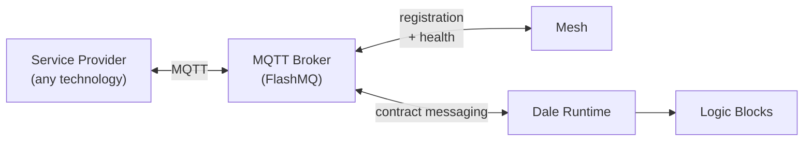
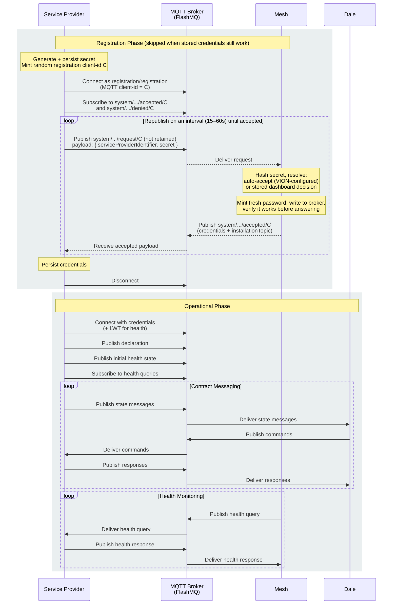

# Service Provider Protocol

A service provider is a standalone process that exposes hardware, bus protocols, or external systems to VION over MQTT. This page defines the protocol that all service providers must implement.

The protocol has two layers:

1. **Mandatory protocol** — registration, declaration, and health reporting. Same for every service provider. Mesh orchestrates this layer.
2. **Service-specific messaging** — topics and payloads defined by each service provider type. The Dale runtime consumes this layer to drive logic blocks. The protocol makes no assumptions about topic or payload structure.

## Architecture



The service provider never communicates with Mesh or the Dale runtime directly — all messages flow through the local MQTT broker. Mesh handles registration and periodic health checks; the Dale runtime subscribes to contract messages (state, commands, responses) and dispatches them to logic blocks. Service providers can be written in any language or technology that supports MQTT 5.0 — .NET, Python, Rust, CODESYS, TwinCAT, or bare-metal firmware.

## Prerequisites

- MQTT 5.0 client library
- Access to the local MQTT broker (default: `flashmq:1883` on the local network)

## Registration

Registration lets Mesh discover new service providers and provision credentials on the local MQTT broker. The same broker is used for both the registration exchange (authenticated with a fixed, public bootstrap user) and operational messaging (authenticated with the provisioned credentials).

What you do with the issued credentials afterwards is up to you. Persisting them is the best option — a restarted provider tries them first, skips registration entirely, and needs no Mesh at all to come up. Holding them only in memory is also fine: reconnects within one process lifetime skip registration, restarts go through it. At the extreme, discarding them and registering again on every disconnect is valid too. The trade-off is coupling: every path that goes through registration needs Mesh to be online, while working held credentials need only the broker — so the more you hold, the less your provider depends on Mesh being up. The one hard rule is independent of that choice: **never republish a registration request faster than Mesh can process one — no more often than once every 15 seconds** — otherwise you may never obtain working credentials (see [Publish the Registration Request](#publish-the-registration-request)).

Registration runs whenever there are no held credentials, or the held ones stop working (see [Reconnecting](#reconnecting)). That fallback is what keeps the protocol self-healing: if the broker ever loses its credential store (for example after a platform update), the operational connect is refused, and the provider registers again — no manual recovery.

### Generate a Secret

On first startup, generate a random, non-guessable secret and persist it to survive restarts. The secret is the provider's proof of identity: Mesh stores a hash of it and compares that hash on every registration, so the same provider identity always presents the same secret. It travels in the registration request payload — never in a topic.

The secret must be high-entropy random. It is stored as a fast unsalted hash on the assumption that it cannot be guessed or brute-forced; a low-entropy secret breaks that assumption. A UUID v4 without hyphens — 32 lowercase hex characters (e.g., `a1b2c3d4e5f6a7b8c9d0e1f2a3b4c5d6`) — is a good format. For .NET service providers, generate it with `Guid.NewGuid().ToString("N")` and hand it to the `ServiceProviderClientConfigurationBuilder` from the [`Vion.ServiceProvider.Sdk`](https://www.nuget.org/profiles/VION-IoT) package — the SDK runs the whole registration flow, including everything below, for you.

### Generate a Registration Client ID

For each registration connection, generate a **random registration client-id**. Any random, non-guessable value that is a valid MQTT topic segment works — the SDK uses a standard GUID string (`Guid.NewGuid().ToString()`). This value routes your registration: all three registration topics are keyed on it, and it **must be exactly the MQTT client-id you connect with** — the broker enforces per-client topic isolation on the connecting client-id, so a mismatch between your connection and your topics breaks the exchange.

Mint a fresh value per registration connection. Never persist it, and never derive it from configuration or from the provider identity — a predictable client-id would let another provider subscribe to your credential-bearing response.

::: warning MQTT Topic Segment Constraints
The registration client-id, serviceIdentifier, and contractIdentifier are all embedded directly in MQTT topics, so each **must be a valid single topic segment**:
- Must **not** contain `/` (topic level separator)
- Must **not** contain `+` or `#` (MQTT wildcard characters)
- Must **not** contain null characters
- Must **not** be empty
- Should be kept under 128 characters (MQTT topics have a 65535-byte UTF-8 limit, but shorter is better for broker performance)
- Hyphens are fine — a standard GUID string works as a segment

The `serviceProviderIdentifier` is embedded in topics too, but carries a stricter rule of its own — see [Publish the Registration Request](#publish-the-registration-request).
:::

### Subscribe to the Response

Connect to the broker with the well-known **registration bootstrap credentials** — username `registration`, password `registration` — using the registration client-id as the MQTT client-id, and subscribe to both:

- `system/serviceProvider/registration/accepted/{registrationClientId}`
- `system/serviceProvider/registration/denied/{registrationClientId}`

These credentials are fixed and public — every service provider uses them to bootstrap. The broker does not accept anonymous connections, and its ACL restricts the `registration` user to exactly the registration topics — publishing a request and subscribing to your accepted and denied responses — so the bootstrap user can read and write nothing else. Only the connection that minted the client-id can receive its credentials. After acceptance, you reconnect with the per-provider credentials Mesh issues (see [Operational Connection](#operational-connection)).

### Publish the Registration Request

Once subscribed, publish the registration request:

| Field | Value |
|-------|-------|
| Topic | `system/serviceProvider/registration/request/{registrationClientId}` |
| Payload | JSON: `{ "serviceProviderIdentifier": "hal-sim", "secret": "a1b2c3d4..." }` |
| QoS | 0 or 1 — the choice is yours; the republish loop below covers a lost message either way |
| Retain | no |
| Content-Type | `application/json` |
| User property `schema` | `ServiceProviderRegistrationRequestPayload` |

The `serviceProviderIdentifier` is a human-readable identifier for this provider instance (for example, `hal-sim`, `codesys-bridge-01`).

- It must match `[A-Za-z0-9_-]`, 1–64 characters.
- It must be unique within the gateway — not globally unique, so different gateways may have providers with the same identifier.
- `mesh` and `registration` are reserved, case-insensitively.

A request with an invalid identifier is denied with `Invalid service provider identifier`.

**Republish the request on an interval until you receive accepted.** Nothing about registration is retained in either direction, so a request published while Mesh is offline, or a response lost in transit, is recovered only by asking again — the loop is the delivery guarantee. Never request faster than a response can arrive: every accepted request issues a fresh password that invalidates the previous one, so requests that outrun the round trip destroy each answer before it can be used, indefinitely. Mesh processes **every** request it receives — there is no server-side deduplication or coalescing, which is what makes the fresh-password rule hold without exception — so pacing is entirely the provider's responsibility. The work behind a response — resolving the request and applying newly provisioned credentials on the broker — takes roughly 0.5–3 seconds on a healthy gateway, so the 15-second interval is that round trip with a wide safety margin, not a measured limit. Still, a fixed 15 seconds leaves no headroom on a badly degraded gateway: either widen the interval automatically, as the SDK does (15 seconds, doubling to 30 and then 60 when consecutive answers arrive too late to use, resetting on success), or use a flat, safer 30–60 seconds. The interval is also your approval latency — dashboard decisions reach you on your next republish — which is the reason to prefer the shorter, self-widening form over a long flat one.

### Handle Acceptance

A registration request is accepted in one of two ways:

- **Manual accept** — a user in the cloud dashboard accepts (or denies) the pending registration. The decision is **stored**, not pushed: it reaches the provider on its next republish, so approval latency is at most one republish interval.
- **Auto-accept** — Mesh has the service provider's secret mounted alongside its own configuration (conventionally, the same secret file the service provider reads), and recognizes the incoming secret as a known, pre-provisioned one. When the secret matches, Mesh accepts automatically without any dashboard action. Only the VION team can set up auto-accept because it requires mounting files into the Mesh container, which customers do not have access to.

Mesh mints a fresh password for every accepted request and confirms it works on the broker before answering, so the credentials you receive were live when they were sent:

```json
{
  "installationTopic": "v1/test/tenant123/gateway456",
  "host": "flashmq",
  "port": 1883,
  "clientId": "hal-sim",
  "username": "hal-sim",
  "password": "generated-password"
}
```

Store these credentials — persisting them is recommended, so a restart reconnects without registering (the storage options are laid out under [Registration](#registration)) — then disconnect and reconnect with them to enter the operational phase.

### Handle Denial

A denial carries a reason — log it. Denial is informational, not terminal: keep republishing the request on the same interval. If the denial was a pending decision later approved in the dashboard, a further republish receives the accepted payload; stopping on denial means never seeing that approval.

## Operational Connection

Reconnect to the broker using the credentials from the accepted registration payload.

| Field | Value |
|-------|-------|
| Host | `host` from accepted payload |
| Port | `port` from accepted payload |
| Client ID | `clientId` from accepted payload |
| Username | `username` from accepted payload |
| Password | `password` from accepted payload |
| Protocol | MQTT 5.0 |

### Last Will Testament

Configure a Last Will Testament (LWT) so the broker publishes an offline health status if the service provider disconnects unexpectedly:

| Field | Value |
|-------|-------|
| Will Topic | `{installationTopic}/{serviceProviderIdentifier}/component/health/state` |
| Will Payload | `ComponentHealthStatusPayload` with `connectionStatus: Offline` |
| Will Content-Type | `application/json` |
| Will QoS | 1 |
| Will Retain | yes |

### Reconnecting

Two rules govern what to do when the operational connection fails, and both follow from how Mesh issues credentials:

- **A refusal means the credentials are dead — replace them, never retry them.** CONNACK `0x86` (Bad User Name or Password) or `0x87` (Not Authorized) means the credentials have been invalidated since they were issued — every accepted registration mints a fresh password and the previous one stops working, and a platform update recreates the broker's credential store empty. Discard them, including any stored copy, and register again. A refusal arriving right after an accept is also a signal that you may be **requesting faster than Mesh can process**: each answer is being invalidated by your own next request before you can use it. The SDK treats it exactly that way — when two accepts in a row produce credentials the broker then refuses, it widens its republish interval to 30 seconds, after two more to 60, and resets to 15 once a connection succeeds.
- **Any other failure may be intermittent — retry, but not forever.** An unreachable host, a timeout, or a dropped connection says nothing about the credentials, so retrying the connection is the right first response. But the credentials also name the broker host and port *as they were when issued*, and those can change — a platform update can rename or move the broker. Retrying a stale endpoint indefinitely strands the provider, so after a bounded period of continuous failure, discard the credentials and register again: registration connects to the endpoint you are *configured* with, not the one the credentials name. Around 90 seconds is a sensible bound — comfortably longer than a broker restart, so intermittent failures never trigger it. Registering against a broker that is merely down costs nothing, since that connection cannot reach it either and the republish loop keeps retrying until it can.

How much of this you implement is a spectrum, and both ends are valid. The thorough end reacts to connect results — held credentials tried first, transport failures retried, refusals and prolonged unreachability falling back to registration, the republish interval widening when answers keep arriving too late to use. That is what the SDK implements, and it gives the best availability: a provider holding working credentials reconnects even while Mesh is down or restarting. If simplicity is the goal, the other end — hold nothing and go straight to registration on every disconnect — is perfectly fine too, with one significant downside: every reconnect then requires Mesh to be online, which couples the provider to Mesh much more tightly. Anything between the two works as well; the only hard rule, whichever shape you choose, is the republish interval — never more often than once every 15 seconds.

## Declaration

After connecting operationally, publish a declaration describing the services and contracts this provider offers.

| Field | Value |
|-------|-------|
| Topic | `{installationTopic}/{serviceProviderIdentifier}/system/serviceProvider/declaration` |
| Payload | JSON (see below) |
| QoS | 0 |
| Retain | yes |
| Content-Type | `application/json` |

Declaration payload:

```json
{
  "services": [
    {
      "identifier": "di",
      "contracts": [
        { "identifier": "di0", "type": "DigitalInput" },
        { "identifier": "di1", "type": "DigitalInput" }
      ]
    },
    {
      "identifier": "do",
      "contracts": [
        { "identifier": "do0", "type": "DigitalOutput" },
        { "identifier": "do1", "type": "DigitalOutput" }
      ]
    }
  ]
}
```

The `type` field must match a `[ServiceProviderContractType]` known to the Dale runtime (for example, `DigitalInput`, `DigitalOutput`, `AnalogInput`, `AnalogOutput`, `ModbusRtu`, or a custom type from a third-party Dale SDK package).

### Properties and measuring points

A service may also declare **properties** (typed read/writable values) and **measuring points** (read-only telemetry) alongside its contracts. Each is an object with a required `identifier` and a required `schema`, plus optional `presentation` and `runtime` siblings:

| Field | Description |
|-------|-------------|
| `identifier` (required) | The name used on the value's state topic and in the dashboard. Must be a valid MQTT topic segment. |
| `schema` (required) | A JSON Schema 2020-12 document in the *Dale profile* describing the value's type, unit, bounds, and read/write mode. |
| `presentation` | UI hints — display name, grouping, ordering, conditional visibility. See [Presentation hints](#presentation-hints). |
| `runtime` | Dale-runtime hints such as persistence. A Dale concern; service providers normally omit it. |

This is the same `{schema, presentation, runtime}` model the Dale runtime emits for logic-block introspection, so the dashboard renders provider values with the same type fidelity as logic-block values. The `schema` maps the value's type onto JSON Schema `type` / `format`:

| Value type | `schema` |
|------------|----------|
| boolean | `{ "type": "boolean" }` |
| integer | `{ "type": "integer", "format": "int32" }` (also `int16`, `int64`, `uint8`, …) |
| number | `{ "type": "number", "format": "double" }` (also `float`) |
| string | `{ "type": "string" }` |
| timestamp | `{ "type": "string", "format": "date-time" }` |
| GUID | `{ "type": "string", "format": "uuid" }` |
| enum | `{ "type": "string", "enum": ["Off", "On", "Auto"] }` |
| struct | `{ "type": "object", "properties": { … }, "required": [ … ], "additionalProperties": false }` |
| array | `{ "type": "array", "items": { … } }` |
| nullable `T?` | the `type` is widened to a list, e.g. `{ "type": ["string", "null"] }` |

The schema carries these extra keywords:

| Keyword | Meaning |
|---------|---------|
| `readOnly` | The value is reported by the provider and never set. Always present on measuring points; add it to properties the dashboard must not write. |
| `writeOnly` | The value is a secret — see [Write-only properties](#write-only-properties). |
| `x-unit` | The engineering unit, e.g. `"W"`, `"kWh"`, `"°C"`. |
| `x-kind` | The measuring-point kind: `"measurement"` (instantaneous reading), `"total"` (cumulative, may rise or fall), or `"totalIncreasing"` (monotonic counter). |
| `minimum` / `maximum` | Numeric bounds. |
| `format` | An advisory string format, e.g. `"ipv4"`, `"hostname"`, `"email"`, `"uri"`. |

A minimal declaration — one writable property and one measuring point:

```json
{
  "services": [
    {
      "identifier": "inverter",
      "properties": [
        {
          "identifier": "targetPower",
          "schema": { "type": "number", "minimum": 0, "maximum": 5000 },
          "presentation": { "displayName": "Target Power" }
        }
      ],
      "measuringPoints": [
        {
          "identifier": "actualPower",
          "schema": { "type": "number", "readOnly": true }
        }
      ]
    }
  ]
}
```

A richer declaration — a struct-typed property with a secret member, and two measuring points carrying units and kinds:

```json
{
  "services": [
    {
      "identifier": "connection",
      "description": "Upstream broker connection",
      "properties": [
        {
          "identifier": "config",
          "schema": {
            "type": "object",
            "title": "Config",
            "properties": {
              "host": { "type": "string" },
              "port": { "type": "integer", "format": "int32", "minimum": 1, "maximum": 65535 },
              "password": { "type": ["string", "null"], "writeOnly": true }
            },
            "required": ["host", "port"],
            "additionalProperties": false
          },
          "presentation": { "displayName": "Connection", "group": "Upstream" }
        }
      ],
      "measuringPoints": [
        {
          "identifier": "activePower",
          "schema": { "type": "number", "format": "double", "readOnly": true, "x-unit": "W", "x-kind": "measurement" }
        },
        {
          "identifier": "energyImported",
          "schema": { "type": "number", "format": "double", "readOnly": true, "x-unit": "kWh", "x-kind": "totalIncreasing" }
        }
      ]
    }
  ]
}
```

.NET providers build these from a `ServiceSchema<T>` — the SDK's `ServiceField`s carry the typed schema and emit the JSON. See [Service Provider SDK](/sdk/service-provider-sdk). Other languages emit the JSON directly.

### Write-only properties

A **write-only** property is a secret — a password, token, or client certificate — that the provider accepts but must never echo back in clear text. Mark the string (a whole-value string property, or a `string` member of a struct) with `"writeOnly": true` in its schema. In v1 only `string` / `string?` positions may be write-only.

Write-only changes how the value crosses the wire in both directions:

- **On read (state publish):** replace every set write-only value with the redaction sentinel `"***"` before publishing. A write-only value that is unset stays `null`, so a reader can still tell an empty secret from a stored, hidden one.
- **On set (property-set):** re-submitting the sentinel `"***"` keeps the stored value unchanged ("leave the secret as-is"); `null` clears it; any other value replaces it. The sentinel is never itself stored.

This is a wire-read-path protection, not encryption at rest: a value stored on disk is not encrypted, and a literal value of exactly `"***"` cannot be distinguished from the sentinel.

.NET providers get this for free — declare the field `WriteOnly` and the SDK redacts on publish and resolves on set at its state boundaries. See [Service Provider SDK](/sdk/service-provider-sdk). Other languages implement the substitution themselves.

### Presentation hints

The `presentation` sibling is advisory — it changes how a value is displayed, never what it is or how it is messaged. VION Cloud stores it and the dashboard renders from it, so a hand-built provider controls layout and formatting the same way a logic block does. Every key is camelCase and optional.

| Key | Description |
|-----|-------------|
| `displayName` | Label override. Falls back to the schema `title`, then the identifier. |
| `group` | Section key. Well-known values: `identity`, `status`, `configuration`, `metric`, `diagnostics`, `alarm`. Any other string renders as its own section with the raw key as the header. |
| `order` | Integer sort hint within a group, ascending. Negatives are allowed. |
| `importance` | Tile rank: `Primary`, `Secondary`, or `Hidden`. Omit it for the normal default. |
| `decimals` | Numeric display precision. |
| `uiHint` | Renderer routing key: `trigger`, `sparkline`, `multiline`, `json`, or `slider`. Unknown values fall back to the default renderer. |
| `format` | Date/duration format token — a moment-compatible token, or the sentinel `relative` / `humanize`. |
| `visibleWhen` | Conditional-visibility predicate. See [Conditional visibility](#conditional-visibility). |

For enum properties, `enumLabels` maps each member name to a display label; a status indicator pairs `uiHint: "statusIndicator"` with `statusMappings`, mapping each member name to a severity (`success`, `info`, `warning`, `error`, `neutral`). Each key behaves as its logic-block counterpart — see [Properties & Measuring Points](/sdk/properties) for the full vocabulary.

### Conditional visibility

`visibleWhen` shows or hides a member based on the live values of other properties on the same provider. It is the mechanism logic blocks use, and the dashboard evaluates a provider's predicates exactly as it does a logic block's. The value is a predicate string — a boolean expression in the shared dialect (`==`, `!=`, `<`, `in [...]`, `&&`, `||`, `!`), documented under [Conditional Visibility](/sdk/properties#conditional-visibility).

This declares a boolean toggle and a second property shown only when the toggle is off:

```json
{
  "services": [
    {
      "identifier": "meter",
      "properties": [
        {
          "identifier": "directMeasurement",
          "schema": { "type": "boolean" },
          "presentation": { "displayName": "Direct Measurement (no CT)", "group": "configuration" }
        },
        {
          "identifier": "primaryCurrent",
          "schema": { "type": "number", "format": "double", "x-unit": "A", "minimum": 1, "maximum": 5000 },
          "presentation": {
            "displayName": "Primary Current",
            "group": "configuration",
            "visibleWhen": "directMeasurement == false"
          }
        }
      ]
    }
  ]
}
```

Three rules are specific to a hand-built declaration:

- **References use the declared `identifier`.** A bare reference (`directMeasurement`) names a property on the same service as the annotated member; a qualified reference (`inverter.targetPower`) names a property on a sibling service of the same provider, addressed by that service's declared `identifier`. Matching is exact and case-sensitive, and resolves only against `properties`, never measuring points.
- **Reference only boolean, integer, enum, or string properties.** The Dale SDK's build-time predicate analyzers do not run on a hand-built payload, so a reference to a number (`double` / `float`), a write-only secret, or a measuring point silently fails to resolve.
- **Visibility is display-only and fail-open.** A hidden member still exists, publishes state, accepts writes, and records telemetry — `visibleWhen` controls only whether the dashboard renders its row. An unresolved or malformed predicate leaves the member visible.

## Health Reporting

Health uses **two channels**: the service provider publishes lifecycle `online` / `offline` to the **state** topic, and Mesh **pulls** health detail on demand with a query/response. The `since` / `reason` discipline at the end of this section matters — getting it wrong floods the cloud.

### Connection state (`online` / `offline`)

`online` / `offline` mean exactly one thing: **whether the service provider is connected to the local broker.** Publish `online` (retained) once you are operationally connected, and configure your [Last Will](#last-will-testament) so the broker publishes `offline` if you drop. **Never** flip `online` / `offline` for any other reason — if an *external* dependency is unreachable (your provider can't reach its upstream cloud or field bus), you are still `online`; report that as **unhealthy** in your health response, not as `offline`.

| Field | Value |
|-------|-------|
| Topic | `{installationTopic}/{serviceProviderIdentifier}/component/health/state` |
| Payload | `ComponentHealthStatusPayload` |
| QoS | 0 |
| Retain | yes |

On an `online` / `offline` message the health **status defaults to `Unknown`** unless you assert one (for example `online` + `Healthy`), which Mesh respects. Set a UTC-now `since` when you can — it lets Mesh distinguish a genuine new `online` from a duplicate (two `online`s with `since` unset are ambiguous). The state topic is **not** only for `online` / `offline` — pushing an actual health *change* here is allowed. But **never push to `state` as part of answering a health poll:** Mesh **clears its pending health request the moment a message lands on the state topic**, so replying on the `ResponseTopic` *and* pushing to `state` corrupts Mesh's request tracking (and a poll doesn't change your health, so there's nothing to push). The only reason to push a health change to `state` is when *another* service provider watches your state and must react when you go unhealthy without polling you. For Mesh, never push — it polls, and the poll response time is part of the evaluation (next section).

### Respond to health queries

Subscribe to `{installationTopic}/{serviceProviderIdentifier}/component/health/get`. When a query arrives, publish your current health to the request's `ResponseTopic`, echoing its `CorrelationData`.

Response timeliness **gates whether Mesh trusts your status at all:** reply **in time** and Mesh respects whatever you report — a timely `Unhealthy` is `Unhealthy`, a timely `Healthy` is `Healthy`. Reply **late, or not at all,** and Mesh ignores your reported status and marks you **unhealthy** ("did not respond in time") — a `Healthy` that arrives too late is still unhealthy. So timeliness is itself the liveness signal, and a provider with nothing of its own to report just answers **`Healthy`, `since = null`, `reason = null`**.

### Keep `since` and `reason` stable

::: warning
Mesh diffs successive health to detect state changes, and **every change is written to a store-and-forward outbox and forwarded to the cloud.** A `since` or `reason` that changes on every response makes *every poll* look like a new state change — and after a cloud-link outage those phantom changes pile up in the outbox, where they can take **hours** to drain on reconnect, delaying real telemetry behind them. So:

- A `null` `since` is fine — Mesh assigns the transition time itself when it first sees the state.
- **Never** stamp the current time on every response.
- **Never** put a constantly-changing value in `reason`. Use a stable category — `"messages dropped"`, not `"dropped 1234 messages"`. Keep the varying count in your logs.
:::

### Wire format

Health is a **JSON** `ComponentHealthStatusPayload`, published with `Content-Type: application/json` and the `schema` user property `ComponentHealthStatusPayload`. Set the same `application/json` `Content-Type` on your [Last Will](#last-will-testament) so the broker's retained `offline` will decodes correctly. JSON keeps health reportable from any provider, including those without a FlatBuffers toolchain (Python, TwinCAT / Structured Text, bare-metal firmware).

The payload wraps a single `component`:

```json
{
  "component": {
    "name": "hal-sim",
    "connectionStatus": "Online",
    "healthStatus": "Healthy",
    "since": null,
    "reason": null,
    "subComponents": null
  }
}
```

| Field | Meaning |
|-------|---------|
| `name` | The component's identifier — a service provider reports its own `serviceProviderIdentifier`. |
| `connectionStatus` | `Online` / `Offline` / `Unknown` — connectivity to the local broker only. |
| `healthStatus` | `Healthy` / `Unhealthy` / `Unknown`. |
| `since` | The UTC timestamp the status has held since, or `null`. |
| `reason` | A stable reason category, or `null`. |
| `subComponents` | An optional nested list of `component` objects, or `null`. |

`subComponents` lets a component report a tree of child statuses, nested to any depth — useful when one provider fronts several devices or upstreams and reports each separately:

```json
{
  "component": {
    "name": "modbus-gateway",
    "connectionStatus": "Online",
    "healthStatus": "Unhealthy",
    "since": null,
    "reason": "device unreachable",
    "subComponents": [
      { "name": "meter-1", "connectionStatus": "Online", "healthStatus": "Healthy", "since": null, "reason": null, "subComponents": null },
      { "name": "meter-2", "connectionStatus": "Online", "healthStatus": "Unhealthy", "since": null, "reason": "device unreachable", "subComponents": null }
    ]
  }
}
```

By convention — **not** enforced by the platform — a component rolls its children's health up into its own `healthStatus`: any `Unhealthy` child makes the parent `Unhealthy` (this takes precedence), otherwise any `Unknown` child makes the parent `Unknown`, and the parent is `Healthy` only when every child is. So one `Unknown` child alone yields `Unknown`; one `Unhealthy` child yields `Unhealthy`; an `Unhealthy` child alongside an `Unknown` child still yields `Unhealthy`. Subcomponents do **not** change the parent's `connectionStatus` — that stays a statement about the parent's own broker connection. This is how other components in the system behave; deriving your own `healthStatus` from your subcomponents is ultimately up to you.

The retained [Last Will](#last-will-testament) carries the same shape with `connectionStatus` `Offline` and `healthStatus` `Unknown`:

```json
{
  "component": {
    "name": "hal-sim",
    "connectionStatus": "Offline",
    "healthStatus": "Unknown",
    "since": null,
    "reason": null,
    "subComponents": null
  }
}
```

## System Control

Mesh can restart a service provider and change its log level at runtime. Both are Mesh → provider commands published under the same `{installationTopic}/{serviceProviderIdentifier}/system/serviceProvider/` prefix as the [declaration](#declaration). Implementing them is recommended — it lets an operator restart a misbehaving provider and raise its log verbosity remotely — but it is not enforced. A provider that does not subscribe simply does not respond: the command is published to a topic with no subscriber and dropped, and nothing errors.

### Restart

A restart command tells the provider to restart. The target is the provider addressed by the topic; the command carries no payload.

| Field | Value |
|-------|-------|
| Topic | `{installationTopic}/{serviceProviderIdentifier}/system/serviceProvider/restart` |
| Direction | Mesh → provider |
| Payload | empty — `RestartPayload` has no fields |

On receipt, exit the process and let your supervisor (a container restart policy, systemd, etc.) bring it back; restarting in place is equally valid. The platform only requires that the provider re-runs registration and re-publishes its declaration afterward. There is no restart response — Mesh observes the provider go `offline`, then `online` again, on the [health state topic](#connection-state-online-offline).

### Log level

A log-level command sets the minimum severity the provider logs at, so an operator can raise verbosity on a misbehaving provider without redeploying it.

| Field | Value |
|-------|-------|
| Topic | `{installationTopic}/{serviceProviderIdentifier}/system/serviceProvider/logLevel/set` |
| Direction | Mesh → provider |
| Payload | JSON: `{ "logLevel": "Debug" }` |
| User property `schema` | `SetLogLevelPayload` |

The level is one of `Trace`, `Debug`, `Information`, `Warning`, `Error`, `Critical`, `None`.

After applying the change, publish the new level back so the cloud reflects the provider's active level:

| Field | Value |
|-------|-------|
| Topic | `{installationTopic}/{serviceProviderIdentifier}/system/serviceProvider/logLevel/state` |
| Direction | provider → Mesh |
| Payload | JSON: `{ "logLevel": "Debug" }` |
| Retain | yes |
| User property `schema` | `LogLevelStatePayload` |

Persist the applied level — for example, to a file in your data directory — and restore it on startup, so a cloud-set level survives a restart instead of reverting to your built-in or configured default. The first-party VION providers do this; it is recommended, not required by the protocol.

## MQTT Message Conventions

All messages during the operational phase follow these conventions:

| Convention | Detail |
|------------|--------|
| Protocol version | MQTT 5.0 required |
| User property `schema` | Payload type name (e.g., `DiStatePayload`, `SetDoPayload`) |
| User property `published_at` | ISO 8601 UTC timestamp |
| Content-Type | `application/x-flatbuffers`, `application/json`, or `application/octet-stream` |

## Service-Specific Messaging

Everything beyond registration, declaration, and health is defined by each service provider type. The protocol does not prescribe topic structure or payload format for service-specific messaging.

### Topic Structure

All service-specific topics follow this pattern:

```text
{installationTopic}/{serviceProviderIdentifier}/{service}/{contract}/{contract-specific-path}
```

| Segment | Description |
|---------|-------------|
| `{installationTopic}` | Received during registration |
| `{serviceProviderIdentifier}` | This provider's identifier |
| `{service}` | Service identifier from the declaration |
| `{contract}` | Contract identifier from the declaration |
| `{contract-specific-path}` | Must start with a unique routing segment, followed by provider-defined actions |

The first three segments after `{installationTopic}` form a **routing prefix** that identifies the provider, service, and contract. The contract-specific path must start with a **routing segment** — a fixed string unique to the contract type that the Dale runtime uses to dispatch messages to the correct handler (e.g., `hw/di` for digital inputs, `hw/modbus` for Modbus, `codesys` for a custom CODESYS handler). Everything after the routing segment is provider-defined.

This structure enables simple broker ACL rules — a provider can be restricted to `{installationTopic}/{its-identifier}/#` with a single rule. Multiple providers can coexist on the same gateway, each providing the same contract types under their own namespace.

### Built-in Contract Type Topics

The built-in contract types (DigitalIo, AnalogIo, ModbusRtu) use fixed action paths that correspond to the `Topics` constants defined in the `Shared.Contracts` package:

DigitalIo provider:

| Topic | Direction |
|-------|-----------|
| `{installationTopic}/{serviceProviderIdentifier}/{service}/{contract}/hw/di/state` | Provider → Runtime (state update) |
| `{installationTopic}/{serviceProviderIdentifier}/{service}/{contract}/hw/do/set` | Runtime → Provider (set command) |
| `{installationTopic}/{serviceProviderIdentifier}/{service}/{contract}/hw/do/set/dale/response` | Provider → Runtime (set acknowledgement) |
| `{installationTopic}/{serviceProviderIdentifier}/{service}/{contract}/hw/do/state` | Provider → Runtime (state confirmation) |

AnalogIo provider:

| Topic | Direction |
|-------|-----------|
| `{installationTopic}/{serviceProviderIdentifier}/{service}/{contract}/hw/ai/state` | Provider → Runtime (state update) |
| `{installationTopic}/{serviceProviderIdentifier}/{service}/{contract}/hw/ao/set` | Runtime → Provider (set command) |
| `{installationTopic}/{serviceProviderIdentifier}/{service}/{contract}/hw/ao/set/dale/response` | Provider → Runtime (set acknowledgement) |
| `{installationTopic}/{serviceProviderIdentifier}/{service}/{contract}/hw/ao/state` | Provider → Runtime (state confirmation) |

Modbus RTU provider:

| Topic | Direction |
|-------|-----------|
| `{installationTopic}/{serviceProviderIdentifier}/{service}/{contract}/hw/modbus/get` | Runtime → Provider (read request) |
| `{installationTopic}/{serviceProviderIdentifier}/{service}/{contract}/hw/modbus/get/dale/response` | Provider → Runtime (read response) |
| `{installationTopic}/{serviceProviderIdentifier}/{service}/{contract}/hw/modbus/set` | Runtime → Provider (write request) |
| `{installationTopic}/{serviceProviderIdentifier}/{service}/{contract}/hw/modbus/set/dale/response` | Provider → Runtime (write response) |

### Custom Contract Type Topics

Custom service providers define their own action paths. The contract-specific path must start with a **routing segment** — a fixed, non-ambiguous topic part that the Dale runtime uses to dispatch messages to the correct handler actor. The runtime matches incoming topics using `topic.Contains(routingSegment)`, so the routing segment must be unique across all registered handler types.

For example, the built-in types use `hw/di`, `hw/do`, `hw/ai`, `hw/ao`, and `hw/modbus` as routing segments. A custom CODESYS provider would define its own (e.g., `codesys`).

::: warning Routing Segment Uniqueness
The routing segment must not be a substring of any other registered routing segment, and vice versa. For example, a segment `hw` would conflict with the built-in `hw/di` because one contains the other. The runtime rejects handler registrations with conflicting routing segments at startup.
:::

The structure after the routing segment is entirely up to the provider. It can be as granular as individual symbol addresses or as simple as a single action keyword with everything else in the payload:

```text
{installationTopic}/{serviceProviderIdentifier}/{service}/{contract}/{routing-segment}/{action...}
```

CODESYS provider (example — one handler, granular topic addressing):

```text
{installationTopic}/codesys-01/plc/cpu1/codesys/state          # Variable state from PLC
{installationTopic}/codesys-01/plc/cpu1/codesys/set            # Write command to PLC
{installationTopic}/codesys-01/plc/cpu1/codesys/get            # Read request
{installationTopic}/codesys-01/plc/cpu1/codesys/get/response   # Read response
```

The Dale runtime subscribes to `{installationTopic}/+/+/+/codesys/#` and routes all matching messages to the `CodesysHandler`. The handler then interprets the remaining topic segments and payload to determine what to do.

Alternatively, a provider that prefers a flat topic structure can put addressing in the payload:

```text
{installationTopic}/codesys-01/plc/cpu1/codesys/rpc    # All requests/responses on one topic
```

### Interaction Patterns

Service providers typically use one or more of these patterns:

**State publishing** — the provider publishes retained state messages. Subscribers receive the latest value immediately on subscription and updates as they occur.

**Command handling** — the Dale runtime publishes commands (e.g., set a digital output). The provider processes the command and publishes a state confirmation.

**Request-response** — for operations the requester needs to confirm, or that return data (a property or register *write*, a Modbus register *read*), use the MQTT 5.0 `ResponseTopic` and `CorrelationData` properties. The requester sets `ResponseTopic` to indicate where the reply should go and `CorrelationData` to correlate it. The responder publishes to that topic, echoing the same `CorrelationData`, and sets a `status` user property — `Success` (with the resulting value as the payload) or `Error` (with an optional `error_message`). Whether the requester blocks on the reply, consumes it asynchronously, or ignores it is the requester's concern — the responder's obligation is the same either way.

::: warning Always reply when a request names a response topic
A `ResponseTopic` on an incoming request is the requester declaring it wants a reply — honor it unconditionally: `Success` once applied, or `Error` with an `error_message` if you reject the request (e.g. a value out of range, or a read-only target). You cannot tell from the message what the requester does while waiting. Some requesters consume replies asynchronously or not at all — but the platform runtime sends automation-driven property sets as *awaited* requests, and if you apply the change without replying it cannot tell success from a dropped message: it retries the set and ultimately reports the automation as failed, **even though you applied the value**. A request without a `ResponseTopic` is fire-and-forget — do not reply. The same applies in reverse: when your provider is the requester and does not need a reply, simply omit the `ResponseTopic`.
:::

### Serialization

Service providers choose their own serialization format. The `Content-Type` MQTT property distinguishes formats:

| Content-Type | Description |
|-------------|-------------|
| `application/x-flatbuffers` | FlatBuffers binary format (used by built-in DigitalIo and AnalogIo) |
| `application/json` | JSON (recommended for custom providers — easiest to implement across technologies) |
| `application/octet-stream` | Custom binary format |

The dale runtime handler for each contract type must understand the serialization used by its corresponding service provider.

### Reserved Topic Prefixes

Service-specific topics must not use these prefixes:

| Prefix | Used by |
|--------|---------|
| `system/serviceProvider/` | Registration protocol (before the installation topic is assigned) |
| `{installationTopic}/{serviceProviderIdentifier}/system/serviceProvider/` | Declaration, restart, and log level |
| `{installationTopic}/{serviceProviderIdentifier}/component/` | Health reporting |

## Lifecycle Summary


