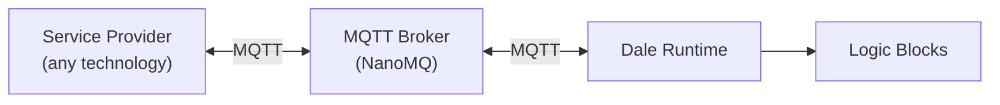
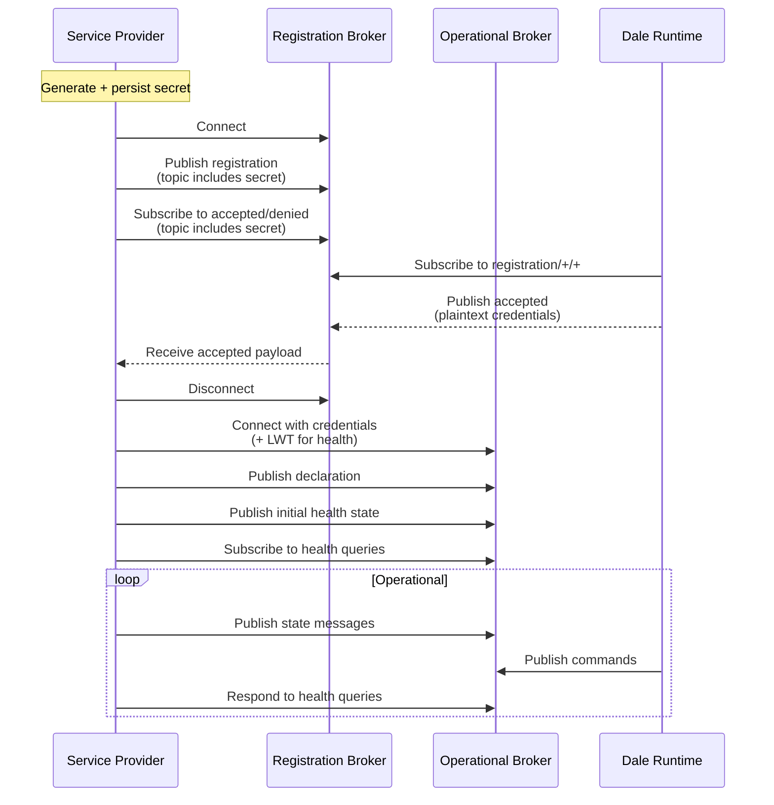

# Service Provider Protocol

A service provider is a standalone process that exposes hardware, bus protocols, or external systems to the Dale runtime over MQTT. This page defines the protocol that all service providers must implement.

The protocol has two layers:

1. **Mandatory protocol** — registration, declaration, and health reporting. Same for every service provider.
2. **Service-specific messaging** — topics and payloads defined by each service provider type. The protocol makes no assumptions about their structure.

## Architecture



The service provider and the Dale runtime never communicate directly. All messages flow through the local MQTT broker. This means service providers can be written in any language or technology that supports MQTT 5.0 — .NET, Python, Rust, CODESYS, TwinCAT, or bare-metal firmware.

## Prerequisites

- MQTT 5.0 client library
- Access to the registration broker (default: `nanomq:1883` on the local network)

## Registration

Registration lets the Dale runtime discover new service providers and provision credentials for the operational broker.

### Generate a Secret

On first startup, generate a random, non-guessable secret (for example, a UUID v4 or 32 bytes of cryptographic randomness). Persist this secret to survive restarts. The secret is used as a topic segment — it ensures that only the service provider that generated it can receive its registration response.

### Publish the Registration

Connect to the registration broker and publish a retained message:

| Field | Value |
|-------|-------|
| Topic | `serviceProvider/registration/{serviceProviderId}/{secret}` |
| Payload | JSON (see below) |
| QoS | 1 (at least once) |
| Retain | yes |
| Content-Type | `application/json` |

Registration payload:

```json
{
  "secret": "{secret}"
}
```

The `serviceProviderId` is a human-readable identifier for this provider instance (for example, `hal-sim`, `codesys-bridge-01`). It must be unique within the installation.

### Subscribe to the Response

Subscribe to both:

- `serviceProvider/registration/accepted/{serviceProviderId}/{secret}`
- `serviceProvider/registration/denied/{serviceProviderId}/{secret}`

The secret in the topic is the security mechanism. The broker must be configured to disallow wildcard subscriptions on `serviceProvider/registration/accepted/#` — this ensures that only the service provider that knows the secret can receive credentials.

### Handle Acceptance

When the Dale runtime accepts the registration, it publishes plaintext JSON to the accepted topic:

```json
{
  "installationTopic": "v1/test/tenant123/gateway456",
  "host": "nanomq",
  "port": 1883,
  "clientId": "sp-hal-sim-a1b2c3",
  "username": "hal-sim",
  "password": "generated-password"
}
```

Store these credentials. Disconnect from the registration broker and proceed to the operational connection.

### Handle Denial

If denied, log the reason and retry after a delay.

## Operational Connection

Connect to the operational broker using the credentials from the accepted registration payload.

| Field | Value |
|-------|-------|
| Host | `host` from accepted payload |
| Port | `port` from accepted payload |
| Client ID | `clientId` from accepted payload |
| Username | `username` from accepted payload |
| Password | `password` from accepted payload |
| Protocol | MQTT 5.0 |

### Last Will Testament

Configure a Last Will Testament (LWT) so the broker publishes an offline health status if the service provider disconnects unexpectedly:

| Field | Value |
|-------|-------|
| Will Topic | `{installationTopic}/component/health/state/{serviceProviderId}` |
| Will Payload | Health status with `connectionStatus: Offline` |
| Will QoS | 1 |
| Will Retain | yes |

## Declaration

After connecting operationally, publish a declaration describing the services and contracts this provider offers.

| Field | Value |
|-------|-------|
| Topic | `{installationTopic}/serviceProvider/declaration/{serviceProviderId}` |
| Payload | JSON (see below) |
| QoS | 1 (at least once) |
| Retain | yes |
| Content-Type | `application/json` |

Declaration payload:

```json
{
  "services": [
    {
      "identifier": "di",
      "contracts": [
        { "identifier": "di0", "type": "DigitalInput" },
        { "identifier": "di1", "type": "DigitalInput" }
      ]
    },
    {
      "identifier": "do",
      "contracts": [
        { "identifier": "do0", "type": "DigitalOutput" },
        { "identifier": "do1", "type": "DigitalOutput" }
      ]
    }
  ]
}
```

The `type` field must match a `[ServiceProviderContractType]` known to the Dale runtime (for example, `DigitalInput`, `DigitalOutput`, `AnalogInput`, `AnalogOutput`, `ModbusRtu`, or a custom type from a third-party Dale SDK package).

## Health Reporting

The Dale runtime periodically queries health status from all components.

### Respond to Health Queries

Subscribe to `{installationTopic}/component/health/get`. When a message arrives, publish a health response to the `ResponseTopic` from the request, echoing the `CorrelationData`.

### Publish Health State

On connection and periodically, publish health state:

| Field | Value |
|-------|-------|
| Topic | `{installationTopic}/component/health/state/{serviceProviderId}` |
| Payload | Health status (FlatBuffer `ComponentHealthStatusPayload` or equivalent) |
| QoS | 0 |
| Retain | yes |

## MQTT Message Conventions

All messages on the operational broker follow these conventions:

| Convention | Detail |
|------------|--------|
| Protocol version | MQTT 5.0 required |
| User property: `Schema` | Payload type name (e.g., `DiStatePayload`, `SetDoPayload`) |
| User property: `PublishedAt` | ISO 8601 UTC timestamp |
| Content-Type | `application/x-flatbuffer`, `application/json`, or `application/octet-stream` |

## Service-Specific Messaging

Everything beyond registration, declaration, and health is defined by each service provider type. The protocol does not prescribe topic structure or payload format for service-specific messaging.

### Topic Structure

All service-specific topics follow this pattern:

```
{installationTopic}/{serviceProviderId}/{service}/{contract}/{action...}
```

| Segment | Description |
|---------|-------------|
| `{installationTopic}` | Received during registration |
| `{serviceProviderId}` | This provider's identifier |
| `{service}` | Service identifier from the declaration |
| `{contract}` | Contract identifier from the declaration |
| `{action...}` | Provider-defined, any depth (e.g., `state`, `set`, `get/response`) |

This structure enables simple broker ACL rules — a provider can be restricted to `{installationTopic}/{its-id}/#` with a single rule. Multiple providers can coexist on the same gateway, each providing the same contract types under their own namespace.

### Examples

DigitalIo provider:

```
{inst}/hal-sim/di/di0/state          # DI state published by provider
{inst}/hal-sim/do/do0/set            # DO command from Dale runtime
{inst}/hal-sim/do/do0/state          # DO state confirmation from provider
```

Modbus RTU provider:

```
{inst}/modbus-bridge/modbus/com1/get            # Read request from runtime
{inst}/modbus-bridge/modbus/com1/get/response   # Read response from provider
{inst}/modbus-bridge/modbus/com1/set            # Write request from runtime
{inst}/modbus-bridge/modbus/com1/set/response   # Write response from provider
```

CODESYS provider:

```
{inst}/codesys-01/plc/temperature/state    # Variable state from PLC
{inst}/codesys-01/plc/valve/set            # Command to PLC
{inst}/codesys-01/plc/valve/state          # Valve state confirmation
```

### Interaction Patterns

Service providers typically use one or more of these patterns:

**State publishing** — the provider publishes retained state messages. Subscribers receive the latest value immediately on subscription and updates as they occur.

**Command handling** — the Dale runtime publishes commands (e.g., set a digital output). The provider processes the command and publishes a state confirmation.

**Request-response** — for operations that return data (e.g., Modbus register reads), use the MQTT 5.0 `ResponseTopic` and `CorrelationData` properties. The requester sets `ResponseTopic` to indicate where the response should go. The responder publishes to that topic with the same `CorrelationData`.

### Serialization

Service providers choose their own serialization format. The `Content-Type` MQTT property distinguishes formats:

| Content-Type | Description |
|-------------|-------------|
| `application/x-flatbuffer` | FlatBuffers binary format (used by built-in DigitalIo and AnalogIo) |
| `application/json` | JSON (recommended for custom providers — easiest to implement across technologies) |
| `application/octet-stream` | Custom binary format |

The dale runtime handler for each contract type must understand the serialization used by its corresponding service provider.

### Reserved Topic Prefixes

Service-specific topics must not use these prefixes (relative to `{installationTopic}`):

| Prefix | Used by |
|--------|---------|
| `serviceProvider/` | Registration and declaration protocol |
| `component/` | Health reporting |

## Lifecycle Summary


